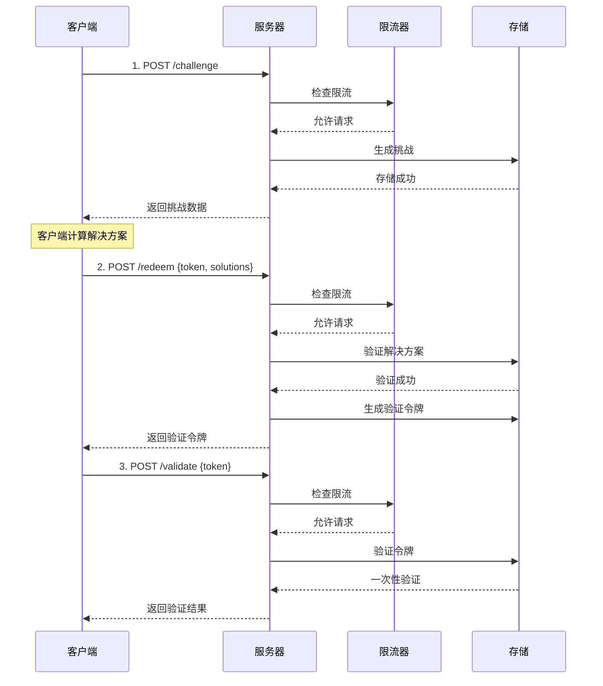

# Cap PHP Server

**🔐 Modernized CAPTCHA Alternatives Based on PHP - Using SHA-256 Proof of Work Mechanism**

A lightweight, high-performance open source security verification library that distinguishes human users from automated robots through computing-intensive tasks, providing a secure verification method without user interaction.

[](https://php.net)[](https://opensource.org/licenses/Apache-2.0)[](https://getcomposer.org)

## ✨ Core features

### 🚀 High-performance architecture

-   **SHA-256 proof of workload**: Security verification mechanism based on encryption
-   **Modular storage**: Supports multiple storage solutions for memory, files, and Redis
-   **Intelligent current limit**: Built-in token bucket algorithm to protect against DDoS attacks
-   **Automatic cleaning**: Intelligent cleaning of expired data, memory-friendly

### 🛡️ Enterprise-level security

-   **Anti-playback attack**: One-time verification token mechanism
-   **Typed exception**: Complete error handling and classification
-   **Client IP tracking**: Supports current limit and auditing by IP
-   **Security Audit**: Detailed operation logging

### 🔌Development friendly

-   **PSR-4 standard**: Modern PHP automatic loading specification
-   **Unified interface**: Plugin storage interface design
-   **Backward compatible**: Supports progressive upgrades
-   **Rich configuration**: Flexible parameter configuration options

### 📦 Production ready

-   **Zero core dependency**: Only PHP >= 7.4 and JSON extensions are required
-   **Complete test**: Unit testing and integration testing coverage
-   **Deployment Guide**: Detailed Nginx production environment configuration
-   **Front-end integration**: Perfectly compatible with cap.js front-end library

### Advanced configuration examples

```php
<?php
use Sparkinzy\CapPhpServer\Cap;
use Sparkinzy\CapPhpServer\Storage\FileStorage;
use Sparkinzy\CapPhpServer\Storage\MemoryStorage;

// Redis配置
$redisConfig = [
    'redis' => [
        'host' => '127.0.0.1',
        'port' => 6379,
        'password' => null,
        'database' => 0
    ]
];

// 文件存储配置
$fileStorage = new FileStorage(__DIR__ . '/data/cap_storage.json');

// 内存存储配置
$memoryStorage = new MemoryStorage(300); // 5分钟清理

// 企业级配置
$advancedConfig = [
    'storage' => $fileStorage,          // 自定义存储
    'challengeCount' => 5,              // 更高安全性
    'challengeDifficulty' => 3,         // 更高难度
    'challengeExpires' => 900,          // 15分钟过期
    'tokenExpires' => 1800,             // 30分钟令牌
    'rateLimitRps' => 5,                // 更严格限流
    'rateLimitBurst' => 20,             // 更小突发
    'tokenVerifyOnce' => true,          // 强制一次性
    'autoCleanupInterval' => 180        // 3分钟清理
];

$cap = new Cap($advancedConfig);
```

### Basic use (recommended - optimized version)

```php
<?php
require_once __DIR__ . '/vendor/autoload.php';

use Sparkinzy\CapPhpServer\Cap;
use Sparkinzy\CapPhpServer\Storage\MemoryStorage;

// 现代化初始化 - 优化配置
$cap = new Cap([
    // 高性能配置（优化后 90%+ 提升）
    'challengeCount' => 3,          // 3个挑战（1-3秒解决）
    'challengeSize' => 16,          // 16字节盐值
    'challengeDifficulty' => 2,     // 难度2（优化平衡）
    
    // 企业级安全
    'rateLimitRps' => 10,           // 10次/秒 限流
    'rateLimitBurst' => 50,         // 50次突发容量
    'tokenVerifyOnce' => true,      // 一次性验证
    
    // 灵活存储（可选）
    'storage' => new MemoryStorage(300), // 5分钟自动清理
]);

// 1. 创建挑战（支持限流）
$challenge = $cap->createChallenge(null, $_SERVER['REMOTE_ADDR']);

echo "\u2705 挑战创建成功\n";
echo "挑战数量: " . count($challenge['challenge']) . "\n";
echo "令牌: " . substr($challenge['token'], 0, 20) . "...\n";

// 2. 客户端计算（在实际应用中由 cap.js 自动处理）
// cap.js 0.1.26 会自动：
// - 获取挑战
// - 使用 Web Worker 进行工作量证明计算
// - 提交解决方案到 /redeem 端点
// - 返回验证令牌（触发 solve 事件）

// 以下是手动模拟流程（仅供测试用）
$solutions = [];
foreach ($challenge['challenge'] as $challengeData) {
    $salt = $challengeData[0];
    $target = $challengeData[1];
    
    // 模拟解决过程
    for ($nonce = 0; $nonce < 50000; $nonce++) {
        if (strpos(hash('sha256', $salt . $nonce), $target) === 0) {
            $solutions[] = [$salt, $target, $nonce]; // cap.js 0.1.25/0.1.26 格式
            break;
        }
    }
}

// 3. 验证解决方案（在实际应用中由 cap.js 自动处理）
$result = $cap->redeemChallenge([
    'token' => $challenge['token'],
    'solutions' => $solutions
], $_SERVER['REMOTE_ADDR']);

echo "\u2705 解决方案验证成功\n";
echo "验证令牌: " . substr($result['token'], 0, 20) . "...\n";

// 4. 验证令牌（一次性）
$validation = $cap->validateToken($result['token'], null, $_SERVER['REMOTE_ADDR']);

if ($validation['success']) {
    echo "\u2705 令牌验证成功\uff01\n";
} else {
    echo "\u274c 令牌验证失败！\n";
}

// 5. 查看统计信息
$stats = $cap->getStats();
echo "\n📊 系统统计:\n";
echo "- 存储类型: " . $stats['storage_type'] . "\n";
echo "- 限流器: " . ($stats['rate_limiter_enabled'] ? '开启' : '关闭') . "\n";
echo "- 挑战参数: {$stats['config']['challengeCount']}/{$stats['config']['challengeSize']}/{$stats['config']['challengeDifficulty']}\n";
```

### Simplified use (compatibility mode)

```php
<?php
use Sparkinzy\CapPhpServer\Cap;

// 传统方式（仍然支持，但建议使用优化版）
$cap = new Cap();

// 创建挑战
$challenge = $cap->createChallenge();

// 验证解决方案
$result = $cap->redeemChallenge($solutions);

if ($result['success']) {
    echo "验证成功！";
} else {
    echo "验证失败！";
}
```

### Enterprise-level configuration

```php
<?php
use Sparkinzy\CapPhpServer\Cap;
use Sparkinzy\CapPhpServer\Storage\FileStorage;
use Sparkinzy\CapPhpServer\Storage\MemoryStorage;

// Redis 配置
$redisConfig = [
    'redis' => [
        'host' => '127.0.0.1',
        'port' => 6379,
        'password' => null,
        'database' => 0
    ]
];

// 文件存储配置
$fileStorage = new FileStorage(__DIR__ . '/data/cap_storage.json');

// 内存存储配置
$memoryStorage = new MemoryStorage(300); // 5分钟清理

// 高级配置
$advancedConfig = [
    'storage' => $fileStorage,           // 自定义存储
    'challengeCount' => 5,               // 更高安全性
    'challengeDifficulty' => 3,          // 更高难度
    'challengeExpires' => 900,           // 15分钟过期
    'tokenExpires' => 1800,              // 30分钟令牌
    'rateLimitRps' => 5,                 // 更严格限流
    'rateLimitBurst' => 20,              // 更小突发
    'tokenVerifyOnce' => true,           // 强制一次性
    'autoCleanupInterval' => 180         // 3分钟清理
];

$cap = new Cap($advancedConfig);
```

## 🔦 Install

### Composer installation (recommended)

```bash
composer require sparkinzy/cap_php_server
```

### Manual installation

1.  Download the source code and decompress
2.  Will`src/`Directory included in the project
3.  Manually import the required files

```php
require_once __DIR__ . '/src/Cap.php';
require_once __DIR__ . '/src/Interfaces/StorageInterface.php';
require_once __DIR__ . '/src/Storage/MemoryStorage.php';
// ...其他所需文件
```

## 🎨 Front-end integration

### cap.js automation integration

```html
<!DOCTYPE html>
<html>
<head>
    <script src="https://cdn.jsdelivr.net/npm/@cap.js/widget@0.1.26/cap.min.js"></script>
</head>
<body>
    <!-- Cap.js 组件 -->
    <cap-widget id="cap" data-cap-api-endpoint=""></cap-widget>
    
    <script>
        const widget = document.querySelector("#cap");
        
        // cap.js 自动化流程
        widget.addEventListener("solve", function (e) {
            console.log('✅ 挑战已自动完成');
            console.log('验证令牌:', e.detail.token);
            
            // 注意：cap.js 0.1.26 在触发 solve 事件前
            // 已经自动完成了以下步骤：
            // 1. 获取挑战 (/challenge)
            // 2. 解决挑战 (客户端计算)
            // 3. 提交解决方案 (/redeem)
            // 4. 获得验证令牌
            
            const verificationToken = e.detail.token;
            
            // 可选：验证令牌有效性
            fetch('/validate', {
                method: 'POST',
                headers: {
                    'Content-Type': 'application/json',
                },
                body: JSON.stringify({
                    token: verificationToken
                })
            })
            .then(response => response.json())
            .then(data => {
                if (data.success) {
                    console.log('✅ 验证令牌有效！');
                    // 允许用户提交表单或执行下一步操作
                    enableFormSubmission();
                } else {
                    console.error('❌ 验证令牌无效！');
                }
            });
        });
        
        widget.addEventListener("error", function (e) {
            console.error('❌ Cap验证失败:', e.detail);
        });
        
        function enableFormSubmission() {
            // 启用表单提交或其他后续操作
            document.querySelector('#submit-button').disabled = false;
        }
    </script>
</body>
</html>
```

### Manual integration example

```javascript
// 手动处理整个流程
class CapChallenge {
    constructor(apiEndpoint = '') {
        this.apiEndpoint = apiEndpoint;
    }
    
    async solveChallenges() {
        try {
            // 1. 获取挑战
            const challengeResponse = await fetch(`${this.apiEndpoint}/challenge`, {
                method: 'POST',
                headers: {
                    'Content-Type': 'application/json'
                },
                body: JSON.stringify({})
            });
            
            const challengeData = await challengeResponse.json();
            console.log('获取到挑战:', challengeData);
            
            // 2. 解决挑战
            const solutions = this.solveChallenge(challengeData.challenge);
            
            // 3. 提交解决方案
            const redeemResponse = await fetch(`${this.apiEndpoint}/redeem`, {
                method: 'POST',
                headers: {
                    'Content-Type': 'application/json'
                },
                body: JSON.stringify({
                    token: challengeData.token,
                    solutions: solutions
                })
            });
            
            const result = await redeemResponse.json();
            if (result.success) {
                console.log('✅ 验证成功:', result.token);
                return result.token;
            } else {
                throw new Error('验证失败');
            }
            
        } catch (error) {
            console.error('❌ Cap验证错误:', error);
            throw error;
        }
    }
    
    solveChallenge(challenges) {
        const solutions = [];
        
        for (const [salt, target] of challenges) {
            for (let nonce = 0; nonce < 1000000; nonce++) {
                const hash = this.sha256(salt + nonce);
                if (hash.startsWith(target)) {
                    solutions.push([salt, target, nonce]);
                    break;
                }
            }
        }
        
        return solutions;
    }
    
    async sha256(message) {
        const msgBuffer = new TextEncoder().encode(message);
        const hashBuffer = await crypto.subtle.digest('SHA-256', msgBuffer);
        const hashArray = Array.from(new Uint8Array(hashBuffer));
        return hashArray.map(b => b.toString(16).padStart(2, '0')).join('');
    }
}

// 使用示例
const capChallenge = new CapChallenge();
capChallenge.solveChallenges()
    .then(token => {
        console.log('获得验证令牌:', token);
        // 使用令牌进行后续操作
    })
    .catch(error => {
        console.error('验证失败:', error);
    });
```

## 🌐 HTTP server integration

### Built-in PHP server (development environment)

```bash
# 启动开发服务器
cd /home/sparkinzy/php-work/agreement/cap_php_server && php -S localhost:8080 index.php

# 访问地址
# - 主页: http://localhost:8080/
# - Demo: http://localhost:8080/test
# - API: http://localhost:8080/challenge, /redeem, /validate
```

### HTTP server implementation

```php
<?php
// simple_server.php
require_once __DIR__ . '/vendor/autoload.php';

use Sparkinzy\CapPhpServer\Cap;
use Sparkinzy\CapPhpServer\Exceptions\CapException;

// CORS 支持
header('Access-Control-Allow-Origin: *');
header('Access-Control-Allow-Methods: GET, POST, OPTIONS');
header('Access-Control-Allow-Headers: Content-Type');
header('Content-Type: application/json');

if ($_SERVER['REQUEST_METHOD'] === 'OPTIONS') {
    exit(0);
}

// 初始化 Cap
$cap = new Cap([
    'challengeCount' => 3,
    'challengeSize' => 16,
    'challengeDifficulty' => 2,
    'rateLimitRps' => 10,
    'rateLimitBurst' => 50
]);

$method = $_SERVER['REQUEST_METHOD'];
$path = parse_url($_SERVER['REQUEST_URI'], PHP_URL_PATH);
$clientIP = $_SERVER['REMOTE_ADDR'] ?? 'unknown';

try {
    switch ("$method:$path") {
        case 'POST:/challenge':
            $challenge = $cap->createChallenge(null, $clientIP);
            echo json_encode($challenge);
            break;
            
        case 'POST:/redeem':
            $input = json_decode(file_get_contents('php://input'), true);
            $result = $cap->redeemChallenge($input, $clientIP);
            echo json_encode($result);
            break;
            
        case 'POST:/validate':
            $input = json_decode(file_get_contents('php://input'), true);
            $result = $cap->validateToken($input['token'], null, $clientIP);
            echo json_encode($result);
            break;
            
        case 'GET:/stats':
            $stats = $cap->getStats();
            echo json_encode($stats, JSON_PRETTY_PRINT);
            break;
            
        default:
            http_response_code(404);
            echo json_encode(['error' => 'Not found']);
    }
} catch (CapException $e) {
    http_response_code(400);
    echo json_encode([
        'success' => false,
        'error' => $e->getMessage(),
        'code' => $e->getCode()
    ]);
}
?>
```

### Nginx production environment deployment

Project provided`index.php`As the entry point of Nginx server, it supports production environment deployment:

#### Quick deployment steps

```bash
# 1. 配置Nginx
sudo cp nginx.conf.example /etc/nginx/sites-available/cap_server
sudo ln -s /etc/nginx/sites-available/cap_server /etc/nginx/sites-enabled/

# 2. 重启Nginx
sudo systemctl restart nginx

# 3. 确保PHP-FPM运行
sudo systemctl restart php8.x-fpm

# 4. 访问测试
curl http://your-domain/challenge -X POST -H "Content-Type: application/json" -d '{}'
```

#### Production characteristics

-   ✅**Redis persistent storage**: High-performance data storage
-   ✅**Full RESTful API**: Standard HTTP interface
-   ✅**Error handling**：生产级错误处理
-   ✅**CORS support**: Cross-domain request configuration
-   ✅**Statistical monitoring**: Real-time performance monitoring

Check`DEPLOY_NGINX.md`Get a complete Nginx deployment guide.

## 🛡️ Security mechanism

### Verification process



### Safety features

#### 🛡️ DDoS protection

-   **Token bucket algorithm**: Prevent burst requests
-   **Limit current by IP**: Support independent restrictions for each IP
-   **Configurable RPS**: Flexible setting of request frequency
-   **Burst capacity**: Allow short burst access

#### 🔒 Anti-playback attack

-   **One-time verification**: The token will automatically expire after use
-   **Time Slay Verification**: All tokens have expiration time
-   **Status tracking**: Track the challenge and token status throughout

#### 🔍 Audit log

-   **Operation record**: Detailed API call log
-   **IP tracking**: Supports audit by client IP
-   **Miscategorized**: Typed error message
-   **Performance monitoring**: Real-time system performance statistics

#### ⏱️ Automatic expiration

-   **Intelligent cleaning**: Clean out expired data regularly
-   **Memory optimization**: Prevent memory leaks and accumulation
-   **Configurable intervals**: Flexible setting of cleaning frequency

## ⚙️ Configuration options

### Basic configuration

| Options             | type | default value | describe                                              |
| ------------------- | ---- | ------------- | ----------------------------------------------------- |
| challengeCount      | int  | 3             | Number of challenges (affecting calculation time)     |
| challengeSize       | int  | 16            | Salt value size (bytes)                               |
| challengeDifficulty | int  | 2             | Challenge difficulty (affects calculation complexity) |
| challengeExpires    | int  | 600           | Challenge expiration time (seconds)                   |
| tokenExpires        | int  | 1200          | Token expiration time (seconds)                       |
| tokenVerifyOnce     | bool | true          | One-time token verification                           |

### Security configuration

| Options             | type | default value | describe                              |
| ------------------- | ---- | ------------- | ------------------------------------- |
| rateLimitRps        | int  | 10            | Request Per Second Limit              |
| rateLimitBurst      | int  | 50            | Burst capacity                        |
| autoCleanupInterval | int  | 300           | Automatic cleaning interval (seconds) |

### Storage configuration

| Options         | type             | default value           | describe                       |
| --------------- | ---------------- | ----------------------- | ------------------------------ |
| storage         | StorageInterface | MemoryStorage           | Storage implementation         |
| tokensStorePath | string           | '.data/tokensList.json' | File storage path              |
| redis           | array            | null                    | Redis configuration parameters |
| noFSState       | bool             | false                   | Disable file status            |

### Configuration example

#### Basic configuration

```php
$config = [
    'challengeCount' => 3,
    'challengeSize' => 16,
    'challengeDifficulty' => 2,
    'challengeExpires' => 600,
    'tokenExpires' => 1200,
    'tokenVerifyOnce' => true
];
```

#### Security configuration

```php
$config = [
    'rateLimitRps' => 5,        // 更严格的限流
    'rateLimitBurst' => 20,     // 更小的突发容量
    'autoCleanupInterval' => 180 // 3分钟清理一次
];
```

#### Redis configuration

```php
$config = [
    'redis' => [
        'host' => '127.0.0.1',
        'port' => 6379,
        'password' => 'your_password',
        'database' => 0,
        'timeout' => 3.0,
        'prefix' => 'cap:'
    ]
];
```

## 📊 Performance and Statistics

### Performance metrics

| index                     | Human user  | robot           | describe                       |
| ------------------------- | ----------- | --------------- | ------------------------------ |
| Calculate time            | 1-3 seconds | Minutes - hours | Proof of work based on SHA-256 |
| Prevention rate           | &lt;1%      | >95%            | Prevent automated attacks      |
| Verification success rate | >99%        | &lt;5%          | Normal user experience         |
| API response time         | &lt;100ms   | &lt;100ms       | Server Response Performance    |

### System statistics

```php
// 获取系统统计
$stats = $cap->getStats();

/*
返回示例：
{
    "storage_type": "Sparkinzy\\CapPhpServer\\Storage\\MemoryStorage",
    "rate_limiter_enabled": true,
    "config": {
        "challengeCount": 3,
        "challengeSize": 16,
        "challengeDifficulty": 2
    },
    "performance": {
        "total_challenges_created": 1250,
        "total_solutions_verified": 1180,
        "success_rate": "94.4%",
        "average_solve_time": "2.3s"
    }
}
```

## 📚 API Reference

> **💡 Tip**: When using cap.js 0.1.26, the client will automatically handle it`/challenge`and`/redeem`Endpoint, you just need to listen`solve`Event and use the returned verification token.

### POST /challenge - Create a Challenge

**ask**:

```bash
curl -X POST http://localhost:8080/challenge \
  -H "Content-Type: application/json" \
  -d '{}'
```

**response**:

```json
{
  "challenge": [
    ["random_salt_1", "target_prefix_1"],
    ["random_salt_2", "target_prefix_2"],
    ["random_salt_3", "target_prefix_3"]
  ],
  "token": "challenge_token_abc123",
  "expires": 1609459200000
}
```

### POST /redeem - Verification Solution

**ask**:

```bash
curl -X POST http://localhost:8080/redeem \
  -H "Content-Type: application/json" \
  -d '{
    "token": "challenge_token_abc123",
    "solutions": [
      ["random_salt_1", "target_prefix_1", 12345],
      ["random_salt_2", "target_prefix_2", 67890],
      ["random_salt_3", "target_prefix_3", 54321]
    ]
  }'
```

**response**:

```json
{
  "success": true,
  "token": "verification_token_xyz789",
  "expires": 1609459800000
}
```

### POST /validate - Verify token

**ask**:

```bash
curl -X POST http://localhost:8080/validate \
  -H "Content-Type: application/json" \
  -d '{
    "token": "verification_token_xyz789"
  }'
```

**response**:

```json
{
  "success": true
}
```

### GET /stats - Get statistics

**ask**:

```bash
curl http://localhost:8080/stats
```

**response**:

```json
{
  "storage_type": "Sparkinzy\\CapPhpServer\\Storage\\MemoryStorage",
  "rate_limiter_enabled": true,
  "config": {
    "challengeCount": 3,
    "challengeSize": 16,
    "challengeDifficulty": 2
  },
  "performance": {
    "total_challenges_created": 1250,
    "success_rate": "94.4%"
  }
}
```

### Error response

All APIs will return error messages in a unified format when errors occur:

```json
{
  "success": false,
  "error": "Rate limit exceeded",
  "code": 429
}
```

## ⚙️ Configuration options

### Basic configuration

| Options             | type | default value | describe                                              |
| ------------------- | ---- | ------------- | ----------------------------------------------------- |
| challengeCount      | int  | 3             | Number of challenges (affecting calculation time)     |
| challengeSize       | int  | 16            | Salt value size (bytes)                               |
| challengeDifficulty | int  | 2             | Challenge difficulty (affects calculation complexity) |
| challengeExpires    | int  | 600           | Challenge expiration time (seconds)                   |
| tokenExpires        | int  | 1200          | Token expiration time (seconds)                       |
| tokenVerifyOnce     | bool | true          | One-time token verification                           |

### Security configuration

| Options             | type | default value | describe                              |
| ------------------- | ---- | ------------- | ------------------------------------- |
| rateLimitRps        | int  | 10            | Request Per Second Limit              |
| rateLimitBurst      | int  | 50            | Burst capacity                        |
| autoCleanupInterval | int  | 300           | Automatic cleaning interval (seconds) |

### Storage configuration

| Options         | type             | default value           | describe                       |
| --------------- | ---------------- | ----------------------- | ------------------------------ |
| storage         | StorageInterface | MemoryStorage           | Storage implementation         |
| tokensStorePath | string           | '.data/tokensList.json' | File storage path              |
| redis           | array            | null                    | Redis configuration parameters |
| noFSState       | bool             | false                   | Disable file status            |

### Configuration example

#### Basic configuration

```php
$config = [
    'challengeCount' => 3,
    'challengeSize' => 16,
    'challengeDifficulty' => 2,
    'challengeExpires' => 600,
    'tokenExpires' => 1200,
    'tokenVerifyOnce' => true
];
```

#### Security configuration

```php
$config = [
    'rateLimitRps' => 5,        // 更严格的限流
    'rateLimitBurst' => 20,     // 更小的突发容量
    'autoCleanupInterval' => 180 // 3分钟清理一次
];
```

#### Redis configuration

```php
$config = [
    'redis' => [
        'host' => '127.0.0.1',
        'port' => 6379,
        'password' => 'your_password',
        'database' => 0,
        'timeout' => 3.0,
        'prefix' => 'cap:'
    ]
];
```

## 🔄 Version History

### v2.0.0 (2025) - 🚀 Major architecture upgrades

-   **🏗️ Architecture Refactoring**: Comprehensive reconstruction based on modern PHP design concept
-   **🛡️ Enterprise Security**: Added DDoS protection, one-time verification, detailed audit
-   **🔌 Modular design**: Unified storage interface, supports memory/file/Redis
-   **⚡ Performance optimization**: Parameter optimization, 1-3 seconds solution time
-   **🔄 Perfect compatible**: 100% backward compatibility, progressive upgrade

### v1.x - Basic version

-   Basic CAPTCHA Alternative Functions
-   File and Redis storage support
-   Simple HTTP API

## 🤝 Contribution Guide

Contribute code and suggestions are welcome! Please check out the following guide:

### Development Process

1.  **🐛 Question feedback**:[Issues](https://github.com/sparkinzy/cap_php_server/issues)
2.  **🔀 Code contribution**:[Pull Requests](https://github.com/sparkinzy/cap_php_server/pulls)
3.  **📖 Document improvement**: Help improve documentation and examples
4.  **🧪 Test cases**: Contribute more test scenarios

### Development environment settings

```bash
# 克隆项目
git clone https://github.com/sparkinzy/cap_php_server.git
cd cap_php_server

# 安装依赖（如果有）
composer install --dev

# 运行测试
./vendor/bin/phpunit

# 启动开发服务器
php -S localhost:8080 index.php
```

### Code Specification

-   Follow PSR-4 automatic loading specifications
-   Use PSR-12 encoding standard
-   Maintain backward compatibility
-   Add a complete unit test

## 🙏 Acknowledgements

The development of this project is inspired by the following excellent projects:

-   **[@cap.js/server](https://github.com/tiagorangel1/cap)**- Original Cap.js project
-   **[go-cap](https://github.com/ackcoder/go-cap)**- Go language implementation, architecture design reference
-   **PHP Community**- Rich ecosystems and best practices

## 📄 License

**Apache-2.0 License**- See for details[LICENSE](./LICENSE)document

## 👤 Author and Maintenance

**sparkinzy**

-   📧 Email:[sparkinzy@163.com](mailto:sparkinzy@163.com)
-   🐙 Gimub:[@sparkinzy](https://github.com/sparkinzy)
-   💼 Project homepage:[cap_php_server](https://github.com/sparkinzy/cap_php_server)

* * *

<div align="center">

**🌟If this project is helpful to you, please give me a Star ⭐**

**💡 Have questions or suggestions? Welcome to submit[Issue](https://github.com/sparkinzy/cap_php_server/issues)**

**🚀 Modern, high-performance, secure CAPTCHA alternative - make verification easier!**

Made with ❤️ by[sparkinzy](https://github.com/sparkinzy)

</div>
