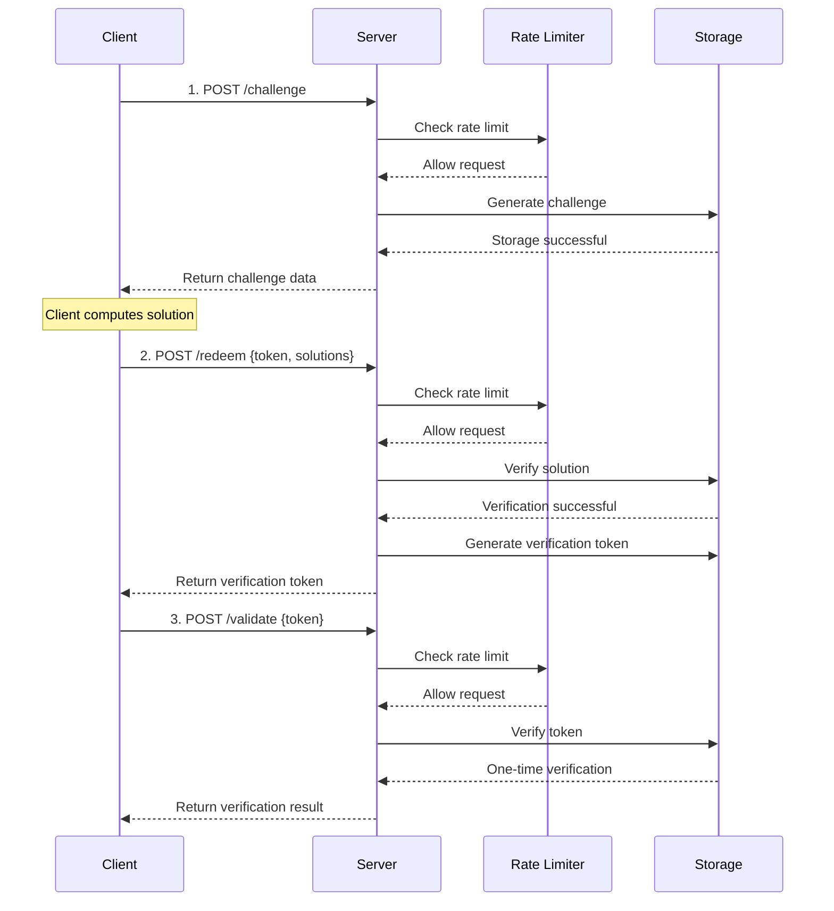

# Cap PHP Server

**🔐 Modernized CAPTCHA Alternatives Based on PHP - Using SHA-256 Proof of Work Mechanism**

A lightweight, high-performance open source security verification library that distinguishes human users from automated robots through computing-intensive tasks, providing a secure verification method without user interaction.

[](https://php.net)[](https://opensource.org/licenses/Apache-2.0)[](https://getcomposer.org)

## ✨ Core features

### 🚀 High-performance architecture

-   **SHA-256 proof of workload**: Security verification mechanism based on encryption
-   **Modular storage**: Supports multiple storage solutions for memory, files, and Redis
-   **Intelligent current limit**: Built-in token bucket algorithm to protect against DDoS attacks
-   **Automatic cleaning**: Intelligent cleaning of expired data, memory-friendly

### 🛡️ Enterprise-level security

-   **Anti-playback attack**: One-time verification token mechanism
-   **Typed exception**: Complete error handling and classification
-   **Client IP tracking**: Supports current limit and auditing by IP
-   **Security Audit**: Detailed operation logging

### 🔌Development friendly

-   **PSR-4 standard**: Modern PHP automatic loading specification
-   **Unified interface**: Plugin storage interface design
-   **Backward compatible**: Supports progressive upgrades
-   **Rich configuration**: Flexible parameter configuration options

### 📦 Production ready

-   **Zero core dependency**: Only PHP >= 7.4 and JSON extensions are required
-   **Complete test**: Unit testing and integration testing coverage
-   **Deployment Guide**: Detailed Nginx production environment configuration
-   **Front-end integration**: Perfectly compatible with cap.js front-end library

### Advanced configuration examples

```php
<?php
use Sparkinzy\CapPhpServer\Cap;
use Sparkinzy\CapPhpServer\Storage\FileStorage;
use Sparkinzy\CapPhpServer\Storage\MemoryStorage;

// Redis configuration
$redisConfig = [
    'redis' => [
        'host' => '127.0.0.1',
        'port' => 6379,
        'password' => null,
        'database' => 0
    ]
];

// File storage configuration
$fileStorage = new FileStorage(__DIR__ . '/data/cap_storage.json');

// Memory storage configuration
$memoryStorage = new MemoryStorage(300); // 5 minutes cleanup

// Enterprise-level configuration
$advancedConfig = [
    'storage' => $fileStorage,          // Custom storage
    'challengeCount' => 5,              // Higher security (number of challenges)
    'challengeDifficulty' => 3,         // Higher difficulty (proof-of-work complexity)
    'challengeExpires' => 900,          // 15 minutes expiration (challenge validity)
    'tokenExpires' => 1800,             // 30 minutes token (verification token validity)
    'rateLimitRps' => 5,                // Stricter rate limit (requests per second)
    'rateLimitBurst' => 20,             // Smaller burst (max burst requests)
    'tokenVerifyOnce' => true,          // Force one-time use (token can only be used once)
    'autoCleanupInterval' => 180        // 3 minutes cleanup (automatic cleanup interval)
];

$cap = new Cap($advancedConfig);
```

### Basic use (recommended - optimized version)

```php
<?php
require_once __DIR__ . '/vendor/autoload.php';

use Sparkinzy\CapPhpServer\Cap;
use Sparkinzy\CapPhpServer\Storage\MemoryStorage;

// Modern initialization - optimized configuration
$cap = new Cap([
    // High performance configuration (90%+ improvement)
    'challengeCount' => 3,          // 3 challenges (1-3 seconds to solve)
    'challengeSize' => 16,          // 16 bytes salt
    'challengeDifficulty' => 2,     // Difficulty 2 (balanced optimization)
    
    // Enterprise-level security
    'rateLimitRps' => 10,           // 10 times/sec rate limit
    'rateLimitBurst' => 50,         // 50 burst capacity
    'tokenVerifyOnce' => true,      // One-time verification
    
    // Flexible storage (optional)
    'storage' => new MemoryStorage(300), // 5 minutes auto cleanup
]);

// 1. Create challenge (supports rate limiting)
$challenge = $cap->createChallenge(null, $_SERVER['REMOTE_ADDR']);

echo "\u2705 Challenge created successfully\n";
echo "Number of challenges: " . count($challenge['challenge']) . "\n";
echo "Token: " . substr($challenge['token'], 0, 20) . "...\n";

// 2. Client-side computation (automatically handled by cap.js in real applications)
// cap.js 0.1.26 will automatically:
// - Get challenge
// - Use Web Worker for proof-of-work computation
// - Submit solution to /redeem endpoint
// - Return verification token (trigger solve event)

// The following is a manual simulation process (for testing only)
$solutions = [];
foreach ($challenge['challenge'] as $challengeData) {
    $salt = $challengeData[0];
    $target = $challengeData[1];
    
    // Simulated solving process
    for ($nonce = 0; $nonce < 50000; $nonce++) {
        if (strpos(hash('sha256', $salt . $nonce), $target) === 0) {
            $solutions[] = [$salt, $target, $nonce]; // cap.js 0.1.25/0.1.26 format
            break;
        }
    }
}

// 3. Verify solution (automatically handled by cap.js in real applications)
$result = $cap->redeemChallenge([
    'token' => $challenge['token'],
    'solutions' => $solutions
], $_SERVER['REMOTE_ADDR']);

echo "\u2705 Solution verified successfully\n";
echo "Verification token: " . substr($result['token'], 0, 20) . "...\n";

// 4. Verify token (one-time)
$validation = $cap->validateToken($result['token'], null, $_SERVER['REMOTE_ADDR']);

if ($validation['success']) {
    echo "\u2705 Token verified successfully!\n";
} else {
    echo "\u274c Token verification failed!\n";
}

// Redis configuration
$stats = $cap->getStats();
echo "\n📊 System statistics:\n";
echo "- Storage type: " . $stats['storage_type'] . "\n";
echo "- Rate limiter: " . ($stats['rate_limiter_enabled'] ? 'Enabled' : 'Disabled') . "\n";
echo "- Challenge parameters: {$stats['config']['challengeCount']}/{$stats['config']['challengeSize']}/{$stats['config']['challengeDifficulty']}\n";
```

### Simplified use (compatibility mode)

```php
<?php
use Sparkinzy\CapPhpServer\Cap;

// Traditional method (still supported, but optimized version recommended)
$cap = new Cap();
// Advanced configuration
// Create challenge
$challenge = $cap->createChallenge();

// Verify solution
$result = $cap->redeemChallenge($solutions);

if ($result['success']) {
    echo "Verification successful!";
} else {
    echo "Verification failed!";
}
```

### Enterprise-level configuration

```php
<?php
use Sparkinzy\CapPhpServer\Cap;
use Sparkinzy\CapPhpServer\Storage\FileStorage;
use Sparkinzy\CapPhpServer\Storage\MemoryStorage;

// Redis configuration
$redisConfig = [
    'redis' => [
        'host' => '127.0.0.1',
        'port' => 6379,
        'password' => null,
        'database' => 0
    ]
];

// File storage configuration
$fileStorage = new FileStorage(__DIR__ . '/data/cap_storage.json');

// Memory storage configuration
$memoryStorage = new MemoryStorage(300); // 5 minutes cleanup

// Advanced configuration
$advancedConfig = [
    'storage' => $fileStorage,           // Custom storage
    'challengeCount' => 5,               // Higher security (number of challenges)
    'challengeDifficulty' => 3,          // Higher difficulty (proof-of-work complexity)
    'challengeExpires' => 900,           // 15 minutes expiration (challenge validity)
    'tokenExpires' => 1800,              // 30 minutes token (verification token validity)
    'rateLimitRps' => 5,                 // Stricter rate limit (requests per second)
    'rateLimitBurst' => 20,              // Smaller burst (max burst requests)
    'tokenVerifyOnce' => true,           // Force one-time use (token can only be used once)
    'autoCleanupInterval' => 180         // 3 minutes cleanup (automatic cleanup interval)
];

$cap = new Cap($advancedConfig);
```

## 🔦 Install

### Composer installation (recommended)

```bash
composer require sparkinzy/cap_php_server
```

### Manual installation

1.  Download the source code and decompress
2.  Will`src/`Directory included in the project
3.  Manually import the required files

```php
require_once __DIR__ . '/src/Cap.php';
require_once __DIR__ . '/src/Interfaces/StorageInterface.php';
require_once __DIR__ . '/src/Storage/MemoryStorage.php';
// ...other required files
```

## 🎨 Front-end integration

### cap.js automation integration

```html
<!DOCTYPE html>
<html>
<head>
    <script src="https://cdn.jsdelivr.net/npm/@cap.js/widget@0.1.26/cap.min.js"></script>
</head>
<body>
    <!-- Cap.js component -->
    <cap-widget id="cap" data-cap-api-endpoint=""></cap-widget>
    
    <script>
        const widget = document.querySelector("#cap");
        
        // cap.js automation process
        widget.addEventListener("solve", function (e) {
            console.log('✅ Challenge automatically completed');
            console.log('Verification token:', e.detail.token);
            
            // Note: cap.js 0.1.26 automatically completes the following steps before triggering the solve event:
            // 1. Get challenge (/challenge)
            // 2. Solve challenge (client-side computation)
            // 3. Submit solution (/redeem)
            // 4. Obtain verification token
            
            const verificationToken = e.detail.token;
            
            // Optional: verify token validity
            fetch('/validate', {
                method: 'POST',
                headers: {
                    'Content-Type': 'application/json',
                },
                body: JSON.stringify({
                    token: verificationToken
                })
            })
            .then(response => response.json())
            .then(data => {
                if (data.success) {
                    console.log('✅ Verification token is valid!');
                    // Allow user to submit form or perform next action
                    enableFormSubmission();
                } else {
                    console.error('❌ Verification token is invalid!');
                }
            });
        });
        
        widget.addEventListener("error", function (e) {
            console.error('❌ Cap verification failed:', e.detail);
        });
        
        function enableFormSubmission() {
            // Enable form submission or other subsequent actions
            document.querySelector('#submit-button').disabled = false;
        }
    </script>
</body>
</html>
```

### Manual integration example

```javascript
// Manually handle the entire process
class CapChallenge {
    constructor(apiEndpoint = '') {
        this.apiEndpoint = apiEndpoint;
    }
    
    async solveChallenges() {
        try {
            // 1. Get challenge
            const challengeResponse = await fetch(`${this.apiEndpoint}/challenge`, {
                method: 'POST',
                headers: {
                    'Content-Type': 'application/json'
                },
                body: JSON.stringify({})
            });
            
            const challengeData = await challengeResponse.json();
            console.log('Challenge received:', challengeData);
            
            // 2. Solve challenge
            const solutions = this.solveChallenge(challengeData.challenge);
            
            // 3. Submit solutions
            const redeemResponse = await fetch(`${this.apiEndpoint}/redeem`, {
                method: 'POST',
                headers: {
                    'Content-Type': 'application/json'
                },
                body: JSON.stringify({
                    token: challengeData.token,
                    solutions: solutions
                })
            });
            
            const result = await redeemResponse.json();
            if (result.success) {
                console.log('✅ Verification successful:', result.token);
                return result.token;
            } else {
                throw new Error('Verification failed');
            }
            
        } catch (error) {
            console.error('❌ Cap verification error:', error);
            throw error;
        }
    }
    
    solveChallenge(challenges) {
        const solutions = [];
        
        for (const [salt, target] of challenges) {
            for (let nonce = 0; nonce < 1000000; nonce++) {
                const hash = this.sha256(salt + nonce);
                if (hash.startsWith(target)) {
                    solutions.push([salt, target, nonce]);
                    break;
                }
            }
        }
        
        return solutions;
    }
    
    async sha256(message) {
        const msgBuffer = new TextEncoder().encode(message);
        const hashBuffer = await crypto.subtle.digest('SHA-256', msgBuffer);
        const hashArray = Array.from(new Uint8Array(hashBuffer));
        return hashArray.map(b => b.toString(16).padStart(2, '0')).join('');
    }
}

// Usage example
const capChallenge = new CapChallenge();
capChallenge.solveChallenges()
    .then(token => {
        console.log('Verification token obtained:', token);
        // Use the token for subsequent operations
    })
    .catch(error => {
        console.error('Verification failed:', error);
    });
```

## 🌐 HTTP server integration

### Built-in PHP server (development environment)

```bash
# Start development server
cd /home/sparkinzy/php-work/agreement/cap_php_server && php -S localhost:8080 index.php

# Access URLs
# - Home: http://localhost:8080/
# - Demo: http://localhost:8080/test
# - API: http://localhost:8080/challenge, /redeem, /validate
```

### HTTP server implementation

```php
<?php
// simple_server.php
require_once __DIR__ . '/vendor/autoload.php';

use Sparkinzy\CapPhpServer\Cap;
use Sparkinzy\CapPhpServer\Exceptions\CapException;

// CORS support
header('Access-Control-Allow-Origin: *');
header('Access-Control-Allow-Methods: GET, POST, OPTIONS');
header('Access-Control-Allow-Headers: Content-Type');
header('Content-Type: application/json');

if ($_SERVER['REQUEST_METHOD'] === 'OPTIONS') {
    exit(0);
}

// Initialize Cap
$cap = new Cap([
    'challengeCount' => 3,
    'challengeSize' => 16,
    'challengeDifficulty' => 2,
    'rateLimitRps' => 10,
    'rateLimitBurst' => 50
]);

$method = $_SERVER['REQUEST_METHOD'];
$path = parse_url($_SERVER['REQUEST_URI'], PHP_URL_PATH);
$clientIP = $_SERVER['REMOTE_ADDR'] ?? 'unknown';

try {
    switch ("$method:$path") {
        case 'POST:/challenge':
            $challenge = $cap->createChallenge(null, $clientIP);
            echo json_encode($challenge);
            break;
            
        case 'POST:/redeem':
            $input = json_decode(file_get_contents('php://input'), true);
            $result = $cap->redeemChallenge($input, $clientIP);
            echo json_encode($result);
            break;
            
        case 'POST:/validate':
            $input = json_decode(file_get_contents('php://input'), true);
            $result = $cap->validateToken($input['token'], null, $clientIP);
            echo json_encode($result);
            break;
            
        case 'GET:/stats':
            $stats = $cap->getStats();
            echo json_encode($stats, JSON_PRETTY_PRINT);
            break;
            
        default:
            http_response_code(404);
            echo json_encode(['error' => 'Not found']);
    }
} catch (CapException $e) {
    http_response_code(400);
    echo json_encode([
        'success' => false,
        'error' => $e->getMessage(),
        'code' => $e->getCode()
    ]);
}
?>
```

### Nginx production environment deployment

Project provided`index.php`As the entry point of Nginx server, it supports production environment deployment:

#### Quick deployment steps

```bash
# 1. Configure Nginx
sudo cp nginx.conf.example /etc/nginx/sites-available/cap_server
sudo ln -s /etc/nginx/sites-available/cap_server /etc/nginx/sites-enabled/

# 2. Restart Nginx
sudo systemctl restart nginx

# 3. Ensure PHP-FPM is running
sudo systemctl restart php8.x-fpm

# 4. Test access
curl http://your-domain/challenge -X POST -H "Content-Type: application/json" -d '{}'
```

#### Production characteristics

-   ✅**Redis persistent storage**: High-performance data storage
-   ✅**Full RESTful API**: Standard HTTP interface
-   ✅**Error handling**: Production-level error handling
-   ✅**CORS support**: Cross-domain request configuration
-   ✅**Statistical monitoring**: Real-time performance monitoring

Check`DEPLOY_NGINX.md`Get a complete Nginx deployment guide.

## 🛡️ Security mechanism

### Verification process



### Safety features

#### 🛡️ DDoS protection

-   **Token bucket algorithm**: Prevent burst requests
-   **Limit current by IP**: Support independent restrictions for each IP
-   **Configurable RPS**: Flexible setting of request frequency
-   **Burst capacity**: Allow short burst access

#### 🔒 Anti-playback attack

-   **One-time verification**: The token will automatically expire after use
-   **Time Slay Verification**: All tokens have expiration time
-   **Status tracking**: Track the challenge and token status throughout

#### 🔍 Audit log

-   **Operation record**: Detailed API call log
-   **IP tracking**: Supports audit by client IP
-   **Miscategorized**: Typed error message
-   **Performance monitoring**: Real-time system performance statistics

#### ⏱️ Automatic expiration

-   **Intelligent cleaning**: Clean out expired data regularly
-   **Memory optimization**: Prevent memory leaks and accumulation
-   **Configurable intervals**: Flexible setting of cleaning frequency

## ⚙️ Configuration options

### Basic configuration

| Options             | type | default value | describe                                              |
| ------------------- | ---- | ------------- | ----------------------------------------------------- |
| challengeCount      | int  | 3             | Number of challenges (affecting calculation time)     |
| challengeSize       | int  | 16            | Salt value size (bytes)                               |
| challengeDifficulty | int  | 2             | Challenge difficulty (affects calculation complexity) |
| challengeExpires    | int  | 600           | Challenge expiration time (seconds)                   |
| tokenExpires        | int  | 1200          | Token expiration time (seconds)                       |
| tokenVerifyOnce     | bool | true          | One-time token verification                           |

### Security configuration

| Options             | type | default value | describe                              |
| ------------------- | ---- | ------------- | ------------------------------------- |
| rateLimitRps        | int  | 10            | Request Per Second Limit              |
| rateLimitBurst      | int  | 50            | Burst capacity                        |
| autoCleanupInterval | int  | 300           | Automatic cleaning interval (seconds) |

### Storage configuration

| Options         | type             | default value           | describe                       |
| --------------- | ---------------- | ----------------------- | ------------------------------ |
| storage         | StorageInterface | MemoryStorage           | Storage implementation         |
| tokensStorePath | string           | '.data/tokensList.json' | File storage path              |
| redis           | array            | null                    | Redis configuration parameters |
| noFSState       | bool             | false                   | Disable file status            |

### Configuration example

#### Basic configuration

```php
$config = [
    'challengeCount' => 3,
    'challengeSize' => 16,
    'challengeDifficulty' => 2,
    'challengeExpires' => 600,
    'tokenExpires' => 1200,
    'tokenVerifyOnce' => true
];
```

#### Security configuration

```php
$config = [
    'rateLimitRps' => 5,        // Stricter rate limiting
    'rateLimitBurst' => 20,     // Smaller burst capacity
    'autoCleanupInterval' => 180 // Clean up every 3 minutes
];
```

#### Redis configuration

```php
$config = [
    'redis' => [
        'host' => '127.0.0.1',
        'port' => 6379,
        'password' => 'your_password',
        'database' => 0,
        'timeout' => 3.0,
        'prefix' => 'cap:'
    ]
];
```

## 📊 Performance and Statistics

### Performance metrics

| index                     | Human user  | robot           | describe                       |
| ------------------------- | ----------- | --------------- | ------------------------------ |
| Calculate time            | 1-3 seconds | Minutes - hours | Proof of work based on SHA-256 |
| Prevention rate           | &lt;1%      | >95%            | Prevent automated attacks      |
| Verification success rate | >99%        | &lt;5%          | Normal user experience         |
| API response time         | &lt;100ms   | &lt;100ms       | Server Response Performance    |

### System statistics

```php
// Get system statistics
$stats = $cap->getStats();

/*
Return example:
{
    "storage_type": "Sparkinzy\\CapPhpServer\\Storage\\MemoryStorage",
    "rate_limiter_enabled": true,
    "config": {
        "challengeCount": 3,
        "challengeSize": 16,
        "challengeDifficulty": 2
    },
    "performance": {
        "total_challenges_created": 1250,
        "total_solutions_verified": 1180,
        "success_rate": "94.4%",
        "average_solve_time": "2.3s"
    }
}
```

## 📚 API Reference

> **💡 Tip**: When using cap.js 0.1.26, the client will automatically handle it`/challenge`and`/redeem`Endpoint, you just need to listen`solve`Event and use the returned verification token.

### POST /challenge - Create a Challenge

**ask**:

```bash
curl -X POST http://localhost:8080/challenge \
  -H "Content-Type: application/json" \
  -d '{}'
```

**response**:

```json
{
  "challenge": [
    ["random_salt_1", "target_prefix_1"],
    ["random_salt_2", "target_prefix_2"],
    ["random_salt_3", "target_prefix_3"]
  ],
  "token": "challenge_token_abc123",
  "expires": 1609459200000
}
```

### POST /redeem - Verification Solution

**ask**:

```bash
curl -X POST http://localhost:8080/redeem \
  -H "Content-Type: application/json" \
  -d '{
    "token": "challenge_token_abc123",
    "solutions": [
      ["random_salt_1", "target_prefix_1", 12345],
      ["random_salt_2", "target_prefix_2", 67890],
      ["random_salt_3", "target_prefix_3", 54321]
    ]
  }'
```

**response**:

```json
{
  "success": true,
  "token": "verification_token_xyz789",
  "expires": 1609459800000
}
```

### POST /validate - Verify token

**ask**:

```bash
curl -X POST http://localhost:8080/validate \
  -H "Content-Type: application/json" \
  -d '{
    "token": "verification_token_xyz789"
  }'
```

**response**:

```json
{
  "success": true
}
```

### GET /stats - Get statistics

**ask**:

```bash
curl http://localhost:8080/stats
```

**response**:

```json
{
  "storage_type": "Sparkinzy\\CapPhpServer\\Storage\\MemoryStorage",
  "rate_limiter_enabled": true,
  "config": {
    "challengeCount": 3,
    "challengeSize": 16,
    "challengeDifficulty": 2
  },
  "performance": {
    "total_challenges_created": 1250,
    "success_rate": "94.4%"
  }
}
```

### Error response

All APIs will return error messages in a unified format when errors occur:

```json
{
  "success": false,
  "error": "Rate limit exceeded",
  "code": 429
}
```

## ⚙️ Configuration options

### Basic configuration

| Options             | type | default value | describe                                              |
| ------------------- | ---- | ------------- | ----------------------------------------------------- |
| challengeCount      | int  | 3             | Number of challenges (affecting calculation time)     |
| challengeSize       | int  | 16            | Salt value size (bytes)                               |
| challengeDifficulty | int  | 2             | Challenge difficulty (affects calculation complexity) |
| challengeExpires    | int  | 600           | Challenge expiration time (seconds)                   |
| tokenExpires        | int  | 1200          | Token expiration time (seconds)                       |
| tokenVerifyOnce     | bool | true          | One-time token verification                           |

### Security configuration

| Options             | type | default value | describe                              |
| ------------------- | ---- | ------------- | ------------------------------------- |
| rateLimitRps        | int  | 10            | Request Per Second Limit              |
| rateLimitBurst      | int  | 50            | Burst capacity                        |
| autoCleanupInterval | int  | 300           | Automatic cleaning interval (seconds) |

### Storage configuration

| Options         | type             | default value           | describe                       |
| --------------- | ---------------- | ----------------------- | ------------------------------ |
| storage         | StorageInterface | MemoryStorage           | Storage implementation         |
| tokensStorePath | string           | '.data/tokensList.json' | File storage path              |
| redis           | array            | null                    | Redis configuration parameters |
| noFSState       | bool             | false                   | Disable file status            |

### Configuration example

#### Basic configuration

```php
$config = [
    'challengeCount' => 3,
    'challengeSize' => 16,
    'challengeDifficulty' => 2,
    'challengeExpires' => 600,
    'tokenExpires' => 1200,
    'tokenVerifyOnce' => true
];
```

#### Security configuration

```php
$config = [
    'rateLimitRps' => 5,        // Stricter rate limiting
    'rateLimitBurst' => 20,     // Smaller burst capacity
    'autoCleanupInterval' => 180 // Clean up every 3 minutes
];
```

#### Redis configuration

```php
$config = [
    'redis' => [
        'host' => '127.0.0.1',
        'port' => 6379,
        'password' => 'your_password',
        'database' => 0,
        'timeout' => 3.0,
        'prefix' => 'cap:'
    ]
];
```

## 🔄 Version History

### v2.0.0 (2025) - 🚀 Major architecture upgrades

-   **🏗️ Architecture Refactoring**: Comprehensive reconstruction based on modern PHP design concept
-   **🛡️ Enterprise Security**: Added DDoS protection, one-time verification, detailed audit
-   **🔌 Modular design**: Unified storage interface, supports memory/file/Redis
-   **⚡ Performance optimization**: Parameter optimization, 1-3 seconds solution time
-   **🔄 Perfect compatible**: 100% backward compatibility, progressive upgrade

### v1.x - Basic version

-   Basic CAPTCHA Alternative Functions
-   File and Redis storage support
-   Simple HTTP API

## 🤝 Contribution Guide

Contribute code and suggestions are welcome! Please check out the following guide:

### Development Process

1.  **🐛 Question feedback**:[Issues](https://github.com/sparkinzy/cap_php_server/issues)
2.  **🔀 Code contribution**:[Pull Requests](https://github.com/sparkinzy/cap_php_server/pulls)
3.  **📖 Document improvement**: Help improve documentation and examples
4.  **🧪 Test cases**: Contribute more test scenarios

### Development environment settings

```bash
# Clone project
git clone https://github.com/sparkinzy/cap_php_server.git
cd cap_php_server

# Install dependencies (if any)
composer install --dev

# Run tests
./vendor/bin/phpunit

# Start development server
php -S localhost:8080 index.php
```

### Code Specification

-   Follow PSR-4 automatic loading specifications
-   Use PSR-12 encoding standard
-   Maintain backward compatibility
-   Add a complete unit test

## 🙏 Acknowledgements

The development of this project is inspired by the following excellent projects:

-   **[@cap.js/server](https://github.com/tiagorangel1/cap)**- Original Cap.js project
-   **[go-cap](https://github.com/ackcoder/go-cap)**- Go language implementation, architecture design reference
-   **PHP Community**- Rich ecosystems and best practices

## 📄 License

**Apache-2.0 License**- See for details[LICENSE](./LICENSE)document

## 👤 Author and Maintenance

**sparkinzy**

-   📧 Email:[sparkinzy@163.com](mailto:sparkinzy@163.com)
-   🐙 Gimub:[@sparkinzy](https://github.com/sparkinzy)
-   💼 Project homepage:[cap_php_server](https://github.com/sparkinzy/cap_php_server)

* * *

<div align="center">

**🌟If this project is helpful to you, please give me a Star ⭐**

**💡 Have questions or suggestions? Welcome to submit[Issue](https://github.com/sparkinzy/cap_php_server/issues)**

**🚀 Modern, high-performance, secure CAPTCHA alternative - make verification easier!**

Made with ❤️ by[sparkinzy](https://github.com/sparkinzy)

</div>
