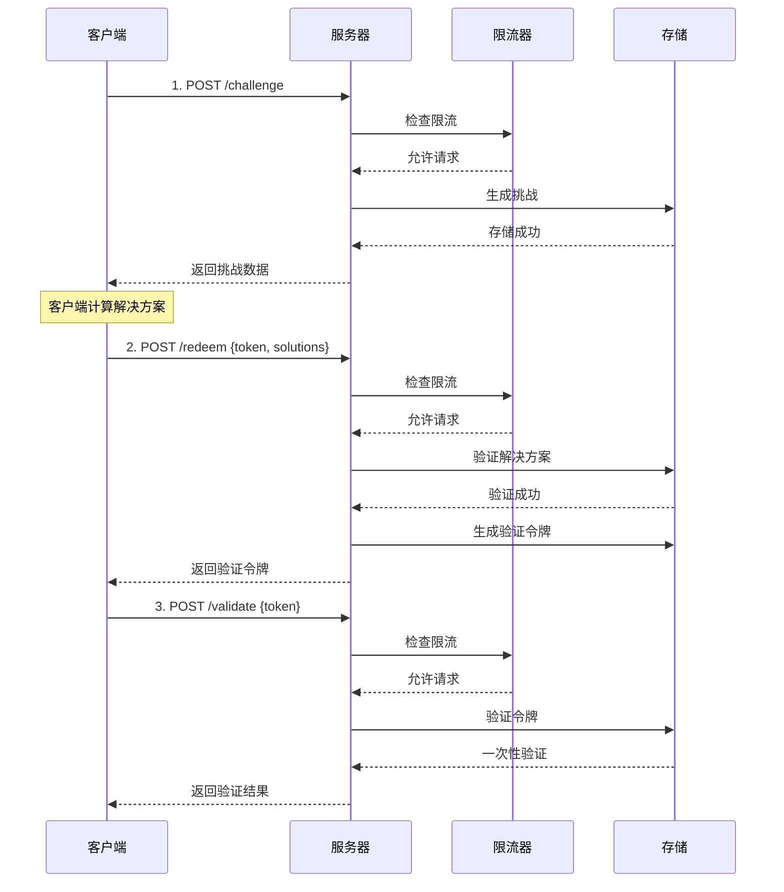

# Serveur PHP CAP

**🔐 Alternatives CAPTCHA modernisées basées sur PHP - Utilisation du mécanisme de preuve de travail SHA-256**

Une bibliothèque de vérification de sécurité open source légère et haute performance qui distingue les utilisateurs humains des robots automatisés à travers des tâches à forte intensité informatique, fournissant une méthode de vérification sécurisée sans interaction utilisateur.

[](https://php.net)[](https://opensource.org/licenses/Apache-2.0)[](https://getcomposer.org)

## ✨ Fonctionnalités de base

### 🚀 Architecture haute performance

-   **SHA-256 Preuve de charge de travail**: Mécanisme de vérification de la sécurité basé sur le cryptage
-   **Stockage modulaire**: Prend en charge plusieurs solutions de stockage pour la mémoire, les fichiers et Redis
-   **Limite de courant intelligente**: Algorithme de godet jeton intégré pour protéger contre les attaques DDOS
-   **Nettoyage automatique**: Nettoyage intelligent des données expirées, conviviale

### Sécurité au niveau de l'entreprise

-   **Attaque anti-playback**: Mécanisme de jeton de vérification unique
-   **Exception dactylographiée**: Compléter la gestion des erreurs et la classification
-   **Suivi IP du client**: Prend en charge la limite actuelle et l'audit par IP
-   **Audit de sécurité**: 详细的操作日志记录

### 🔌Développement convivial

-   **Norme PSR-4**: Spécification de chargement automatique PHP moderne
-   **Interface unifiée**: Conception de l'interface de stockage du plugin
-   **Compatible en arrière**: Soutient les mises à niveau progressives
-   **Configuration riche**: Options de configuration des paramètres flexibles

### 📦 Production prête

-   **Dépendance noyau zéro**: Seules PHP> = 7,4 et des extensions JSON sont requises
-   **Test complet**: Couverture des tests et des tests d'intégration unitaires
-   **Guide de déploiement**: Configuration détaillée de l'environnement de production de Nginx
-   **Intégration frontale**: Parfaitement compatible avec la bibliothèque frontale cap.js

### Exemples de configuration avancés

```php
<?php
use Sparkinzy\CapPhpServer\Cap;
use Sparkinzy\CapPhpServer\Storage\FileStorage;
use Sparkinzy\CapPhpServer\Storage\MemoryStorage;

// Redis配置
$redisConfig = [
    'redis' => [
        'host' => '127.0.0.1',
        'port' => 6379,
        'password' => null,
        'database' => 0
    ]
];

// 文件存储配置
$fileStorage = new FileStorage(__DIR__ . '/data/cap_storage.json');

// 内存存储配置
$memoryStorage = new MemoryStorage(300); // 5分钟清理

// 企业级配置
$advancedConfig = [
    'storage' => $fileStorage,          // 自定义存储
    'challengeCount' => 5,              // 更高安全性
    'challengeDifficulty' => 3,         // 更高难度
    'challengeExpires' => 900,          // 15分钟过期
    'tokenExpires' => 1800,             // 30分钟令牌
    'rateLimitRps' => 5,                // 更严格限流
    'rateLimitBurst' => 20,             // 更小突发
    'tokenVerifyOnce' => true,          // 强制一次性
    'autoCleanupInterval' => 180        // 3分钟清理
];

$cap = new Cap($advancedConfig);
```

### Utilisation de base (recommandation - version optimisée)

```php
<?php
require_once __DIR__ . '/vendor/autoload.php';

use Sparkinzy\CapPhpServer\Cap;
use Sparkinzy\CapPhpServer\Storage\MemoryStorage;

// 现代化初始化 - 优化配置
$cap = new Cap([
    // 高性能配置（优化后 90%+ 提升）
    'challengeCount' => 3,          // 3个挑战（1-3秒解决）
    'challengeSize' => 16,          // 16字节盐值
    'challengeDifficulty' => 2,     // 难度2（优化平衡）
    
    // 企业级安全
    'rateLimitRps' => 10,           // 10次/秒 限流
    'rateLimitBurst' => 50,         // 50次突发容量
    'tokenVerifyOnce' => true,      // 一次性验证
    
    // 灵活存储（可选）
    'storage' => new MemoryStorage(300), // 5分钟自动清理
]);

// 1. 创建挑战（支持限流）
$challenge = $cap->createChallenge(null, $_SERVER['REMOTE_ADDR']);

echo "\u2705 挑战创建成功\n";
echo "挑战数量: " . count($challenge['challenge']) . "\n";
echo "令牌: " . substr($challenge['token'], 0, 20) . "...\n";

// 2. 客户端计算（在实际应用中由 cap.js 自动处理）
// cap.js 0.1.26 会自动：
// - 获取挑战
// - 使用 Web Worker 进行工作量证明计算
// - 提交解决方案到 /redeem 端点
// - 返回验证令牌（触发 solve 事件）

// 以下是手动模拟流程（仅供测试用）
$solutions = [];
foreach ($challenge['challenge'] as $challengeData) {
    $salt = $challengeData[0];
    $target = $challengeData[1];
    
    // 模拟解决过程
    for ($nonce = 0; $nonce < 50000; $nonce++) {
        if (strpos(hash('sha256', $salt . $nonce), $target) === 0) {
            $solutions[] = [$salt, $target, $nonce]; // cap.js 0.1.25/0.1.26 格式
            break;
        }
    }
}

// 3. 验证解决方案（在实际应用中由 cap.js 自动处理）
$result = $cap->redeemChallenge([
    'token' => $challenge['token'],
    'solutions' => $solutions
], $_SERVER['REMOTE_ADDR']);

echo "\u2705 解决方案验证成功\n";
echo "验证令牌: " . substr($result['token'], 0, 20) . "...\n";

// 4. 验证令牌（一次性）
$validation = $cap->validateToken($result['token'], null, $_SERVER['REMOTE_ADDR']);

if ($validation['success']) {
    echo "\u2705 令牌验证成功\uff01\n";
} else {
    echo "\u274c 令牌验证失败！\n";
}

// 5. 查看统计信息
$stats = $cap->getStats();
echo "\n📊 系统统计:\n";
echo "- 存储类型: " . $stats['storage_type'] . "\n";
echo "- 限流器: " . ($stats['rate_limiter_enabled'] ? '开启' : '关闭') . "\n";
echo "- 挑战参数: {$stats['config']['challengeCount']}/{$stats['config']['challengeSize']}/{$stats['config']['challengeDifficulty']}\n";
```

### Utilisation simplifiée (mode de compatibilité)

```php
<?php
use Sparkinzy\CapPhpServer\Cap;

// 传统方式（仍然支持，但建议使用优化版）
$cap = new Cap();

// 创建挑战
$challenge = $cap->createChallenge();

// 验证解决方案
$result = $cap->redeemChallenge($solutions);

if ($result['success']) {
    echo "验证成功！";
} else {
    echo "验证失败！";
}
```

### Configuration au niveau de l'entreprise

```php
<?php
use Sparkinzy\CapPhpServer\Cap;
use Sparkinzy\CapPhpServer\Storage\FileStorage;
use Sparkinzy\CapPhpServer\Storage\MemoryStorage;

// Redis 配置
$redisConfig = [
    'redis' => [
        'host' => '127.0.0.1',
        'port' => 6379,
        'password' => null,
        'database' => 0
    ]
];

// 文件存储配置
$fileStorage = new FileStorage(__DIR__ . '/data/cap_storage.json');

// 内存存储配置
$memoryStorage = new MemoryStorage(300); // 5分钟清理

// 高级配置
$advancedConfig = [
    'storage' => $fileStorage,           // 自定义存储
    'challengeCount' => 5,               // 更高安全性
    'challengeDifficulty' => 3,          // 更高难度
    'challengeExpires' => 900,           // 15分钟过期
    'tokenExpires' => 1800,              // 30分钟令牌
    'rateLimitRps' => 5,                 // 更严格限流
    'rateLimitBurst' => 20,              // 更小突发
    'tokenVerifyOnce' => true,           // 强制一次性
    'autoCleanupInterval' => 180         // 3分钟清理
];

$cap = new Cap($advancedConfig);
```

## 🔦 Installer

### Installation du compositeur (recommandé)

```bash
composer require sparkinzy/cap_php_server
```

### Installation manuelle

1.  Téléchargez le code source et décompressez
2.  Volonté`src/`Répertoire inclus dans le projet
3.  Importez manuellement les fichiers requis

```php
require_once __DIR__ . '/src/Cap.php';
require_once __DIR__ . '/src/Interfaces/StorageInterface.php';
require_once __DIR__ . '/src/Storage/MemoryStorage.php';
// ...其他所需文件
```

## 🎨 Intégration frontale

### Cap.js Automation Integration

```html
<!DOCTYPE html>
<html>
<head>
    <script src="https://cdn.jsdelivr.net/npm/@cap.js/widget@0.1.26/cap.min.js"></script>
</head>
<body>
    <!-- Cap.js 组件 -->
    <cap-widget id="cap" data-cap-api-endpoint=""></cap-widget>
    
    <script>
        const widget = document.querySelector("#cap");
        
        // cap.js 自动化流程
        widget.addEventListener("solve", function (e) {
            console.log('✅ 挑战已自动完成');
            console.log('验证令牌:', e.detail.token);
            
            // 注意：cap.js 0.1.26 在触发 solve 事件前
            // 已经自动完成了以下步骤：
            // 1. 获取挑战 (/challenge)
            // 2. 解决挑战 (客户端计算)
            // 3. 提交解决方案 (/redeem)
            // 4. 获得验证令牌
            
            const verificationToken = e.detail.token;
            
            // 可选：验证令牌有效性
            fetch('/validate', {
                method: 'POST',
                headers: {
                    'Content-Type': 'application/json',
                },
                body: JSON.stringify({
                    token: verificationToken
                })
            })
            .then(response => response.json())
            .then(data => {
                if (data.success) {
                    console.log('✅ 验证令牌有效！');
                    // 允许用户提交表单或执行下一步操作
                    enableFormSubmission();
                } else {
                    console.error('❌ 验证令牌无效！');
                }
            });
        });
        
        widget.addEventListener("error", function (e) {
            console.error('❌ Cap验证失败:', e.detail);
        });
        
        function enableFormSubmission() {
            // 启用表单提交或其他后续操作
            document.querySelector('#submit-button').disabled = false;
        }
    </script>
</body>
</html>
```

### Exemple d'intégration manuelle

```javascript
// 手动处理整个流程
class CapChallenge {
    constructor(apiEndpoint = '') {
        this.apiEndpoint = apiEndpoint;
    }
    
    async solveChallenges() {
        try {
            // 1. 获取挑战
            const challengeResponse = await fetch(`${this.apiEndpoint}/challenge`, {
                method: 'POST',
                headers: {
                    'Content-Type': 'application/json'
                },
                body: JSON.stringify({})
            });
            
            const challengeData = await challengeResponse.json();
            console.log('获取到挑战:', challengeData);
            
            // 2. 解决挑战
            const solutions = this.solveChallenge(challengeData.challenge);
            
            // 3. 提交解决方案
            const redeemResponse = await fetch(`${this.apiEndpoint}/redeem`, {
                method: 'POST',
                headers: {
                    'Content-Type': 'application/json'
                },
                body: JSON.stringify({
                    token: challengeData.token,
                    solutions: solutions
                })
            });
            
            const result = await redeemResponse.json();
            if (result.success) {
                console.log('✅ 验证成功:', result.token);
                return result.token;
            } else {
                throw new Error('验证失败');
            }
            
        } catch (error) {
            console.error('❌ Cap验证错误:', error);
            throw error;
        }
    }
    
    solveChallenge(challenges) {
        const solutions = [];
        
        for (const [salt, target] of challenges) {
            for (let nonce = 0; nonce < 1000000; nonce++) {
                const hash = this.sha256(salt + nonce);
                if (hash.startsWith(target)) {
                    solutions.push([salt, target, nonce]);
                    break;
                }
            }
        }
        
        return solutions;
    }
    
    async sha256(message) {
        const msgBuffer = new TextEncoder().encode(message);
        const hashBuffer = await crypto.subtle.digest('SHA-256', msgBuffer);
        const hashArray = Array.from(new Uint8Array(hashBuffer));
        return hashArray.map(b => b.toString(16).padStart(2, '0')).join('');
    }
}

// 使用示例
const capChallenge = new CapChallenge();
capChallenge.solveChallenges()
    .then(token => {
        console.log('获得验证令牌:', token);
        // 使用令牌进行后续操作
    })
    .catch(error => {
        console.error('验证失败:', error);
    });
```

## Intégration du serveur HTTP

### Serveur PHP intégré (environnement de développement)

```bash
# 启动开发服务器
cd /home/sparkinzy/php-work/agreement/cap_php_server && php -S localhost:8080 index.php

# 访问地址
# - 主页: http://localhost:8080/
# - Demo: http://localhost:8080/test
# - API: http://localhost:8080/challenge, /redeem, /validate
```

### Implémentation du serveur HTTP

```php
<?php
// simple_server.php
require_once __DIR__ . '/vendor/autoload.php';

use Sparkinzy\CapPhpServer\Cap;
use Sparkinzy\CapPhpServer\Exceptions\CapException;

// CORS 支持
header('Access-Control-Allow-Origin: *');
header('Access-Control-Allow-Methods: GET, POST, OPTIONS');
header('Access-Control-Allow-Headers: Content-Type');
header('Content-Type: application/json');

if ($_SERVER['REQUEST_METHOD'] === 'OPTIONS') {
    exit(0);
}

// 初始化 Cap
$cap = new Cap([
    'challengeCount' => 3,
    'challengeSize' => 16,
    'challengeDifficulty' => 2,
    'rateLimitRps' => 10,
    'rateLimitBurst' => 50
]);

$method = $_SERVER['REQUEST_METHOD'];
$path = parse_url($_SERVER['REQUEST_URI'], PHP_URL_PATH);
$clientIP = $_SERVER['REMOTE_ADDR'] ?? 'unknown';

try {
    switch ("$method:$path") {
        case 'POST:/challenge':
            $challenge = $cap->createChallenge(null, $clientIP);
            echo json_encode($challenge);
            break;
            
        case 'POST:/redeem':
            $input = json_decode(file_get_contents('php://input'), true);
            $result = $cap->redeemChallenge($input, $clientIP);
            echo json_encode($result);
            break;
            
        case 'POST:/validate':
            $input = json_decode(file_get_contents('php://input'), true);
            $result = $cap->validateToken($input['token'], null, $clientIP);
            echo json_encode($result);
            break;
            
        case 'GET:/stats':
            $stats = $cap->getStats();
            echo json_encode($stats, JSON_PRETTY_PRINT);
            break;
            
        default:
            http_response_code(404);
            echo json_encode(['error' => 'Not found']);
    }
} catch (CapException $e) {
    http_response_code(400);
    echo json_encode([
        'success' => false,
        'error' => $e->getMessage(),
        'code' => $e->getCode()
    ]);
}
?>
```

### Déploiement de l'environnement de production de Nginx

Projet fourni`index.php`En tant que point d'entrée du serveur Nginx, il prend en charge le déploiement de l'environnement de production:

#### Étapes de déploiement rapide

```bash
# 1. 配置Nginx
sudo cp nginx.conf.example /etc/nginx/sites-available/cap_server
sudo ln -s /etc/nginx/sites-available/cap_server /etc/nginx/sites-enabled/

# 2. 重启Nginx
sudo systemctl restart nginx

# 3. 确保PHP-FPM运行
sudo systemctl restart php8.x-fpm

# 4. 访问测试
curl http://your-domain/challenge -X POST -H "Content-Type: application/json" -d '{}'
```

#### Caractéristiques de production

-   ✅**Redis stockage persistant**: Stockage de données haute performance
-   ✅**API RESTFul complet**: Interface HTTP standard
-   ✅**Gestion des erreurs**: Gestion des erreurs au niveau de la production
-   ✅**CORS Soutien**: Configuration de la demande de domaine croisé
-   ✅**Surveillance statistique**: Surveillance des performances en temps réel

Vérifier`DEPLOY_NGINX.md`Obtenez un guide de déploiement Nginx complet.

## 🛡️ Mécanisme de sécurité

### Processus de vérification



### Caractéristiques de sécurité

#### 🛡️ Protection DDOS

-   **Algorithme de seau de jeton**: Empêcher les demandes d'éclatement
-   **Limiter le courant par IP**: Soutenir les restrictions indépendantes pour chaque IP
-   **RPS configurables**: Réglage flexible de la fréquence de demande
-   **Capacité d'éclatement**: Autoriser l'accès à l'éclatement court

#### 🔒 Attaque anti-playback

-   **Vérification unique**: Le jeton expirera automatiquement après utilisation
-   **Vérification du temps de temps**: Tous les jetons ont un temps d'expiration
-   **Suivi de statut**: Suivre le défi et le statut de jeton tout au long

#### 🔍 Journal d'audit

-   **Enregistrement de fonctionnement**: Journal d'appel API détaillé
-   **Suivi IP**: Prend en charge l'audit par IP client
-   **Défaut**: Message d'erreur tapé
-   **Surveillance des performances**: Statistiques de performance du système en temps réel

#### ⏱️ Expiration automatique

-   **Nettoyage intelligent**: Nettoyer régulièrement les données expirées
-   **Optimisation de la mémoire**: Empêcher les fuites de mémoire et l'accumulation
-   **Intervalles configurables**: Réglage flexible de la fréquence de nettoyage

## ⚙️ Options de configuration

### Configuration de base

| Options                  | taper | valeur par défaut | décrire                                              |
| ------------------------ | ----- | ----------------- | ---------------------------------------------------- |
| challengeCount           | int   | 3                 | Nombre de défis (affectant le temps de calcul)       |
| défier                   | int   | 16                | Taille de la valeur du sel (octets)                  |
| Déterminer la difficulté | int   | 2                 | Difficulté au défi (affecte la complexité du calcul) |
| défier                   | int   | 600               | Défi le temps d'expiration (secondes)                |
| tokenexpires             | int   | 1200              | Temps d'expiration des jetons (secondes)             |
| tokenverifyonce          | bool  | vrai              | Vérification à jeton unique                          |

### Configuration de sécurité

| Options             | taper | valeur par défaut | décrire                                        |
| ------------------- | ----- | ----------------- | ---------------------------------------------- |
| ratelimitrps        | int   | 10                | Demande par seconde limite                     |
| Ratelimitburst      | int   | 50                | Capacité d'éclatement                          |
| autocleanupinterval | int   | 300               | Intervalle de nettoyage automatique (secondes) |

### Configuration de stockage

| Options               | taper             | valeur par défaut         | décrire                           |
| --------------------- | ----------------- | ------------------------- | --------------------------------- |
| stockage              | Storage Interface | Mémoire de mémoire        | Mise en œuvre du stockage         |
| plate-forme de jetons | chaîne            | '.data / tokenslist.json' | Chemin de stockage de fichiers    |
| redis                 | tableau           | nul                       | Paramètres de configuration reded |
| nofsstate             | bool              | FAUX                      | Désactiver l'état du fichier      |

### Exemple de configuration

#### Configuration de base

```php
$config = [
    'challengeCount' => 3,
    'challengeSize' => 16,
    'challengeDifficulty' => 2,
    'challengeExpires' => 600,
    'tokenExpires' => 1200,
    'tokenVerifyOnce' => true
];
```

#### Configuration de sécurité

```php
$config = [
    'rateLimitRps' => 5,        // 更严格的限流
    'rateLimitBurst' => 20,     // 更小的突发容量
    'autoCleanupInterval' => 180 // 3分钟清理一次
];
```

#### Configuration redis

```php
$config = [
    'redis' => [
        'host' => '127.0.0.1',
        'port' => 6379,
        'password' => 'your_password',
        'database' => 0,
        'timeout' => 3.0,
        'prefix' => 'cap:'
    ]
];
```

## 📊 Performances et statistiques

### Métriques de performance

| indice                              | Utilisateur humain | robot            | décrire                            |
| ----------------------------------- | ------------------ | ---------------- | ---------------------------------- |
| Calculer l'heure                    | 1 à 3 secondes     | Minutes - heures | Preuve de travail basé sur SHA-256 |
| Taux de prévention                  | &lt;1%             | >95%             | Empêcher les attaques automatisées |
| Taux de réussite de la vérification | >99%               | &lt;5%           | Expérience utilisateur normale     |
| Temps de réponse de l'API           | &lt;100 ms         | &lt;100 ms       | Performances de réponse du serveur |

### Statistiques du système

```php
// 获取系统统计
$stats = $cap->getStats();

/*
返回示例：
{
    "storage_type": "Sparkinzy\\CapPhpServer\\Storage\\MemoryStorage",
    "rate_limiter_enabled": true,
    "config": {
        "challengeCount": 3,
        "challengeSize": 16,
        "challengeDifficulty": 2
    },
    "performance": {
        "total_challenges_created": 1250,
        "total_solutions_verified": 1180,
        "success_rate": "94.4%",
        "average_solve_time": "2.3s"
    }
}
```

## 📚 Référence de l'API

> **💡 Astuce**: Lors de l'utilisation de cap.js 0.1.26, le client le gérera automatiquement`/challenge`et`/redeem`Point final, il vous suffit d'écouter`solve`Événement et utilisez le jeton de vérification retourné.

### Post / défi - Créez un défi

**demander**:

```bash
curl -X POST http://localhost:8080/challenge \
  -H "Content-Type: application/json" \
  -d '{}'
```

**réponse**:

```json
{
  "challenge": [
    ["random_salt_1", "target_prefix_1"],
    ["random_salt_2", "target_prefix_2"],
    ["random_salt_3", "target_prefix_3"]
  ],
  "token": "challenge_token_abc123",
  "expires": 1609459200000
}
```

### Solution post / échange - Vérification

**demander**:

```bash
curl -X POST http://localhost:8080/redeem \
  -H "Content-Type: application/json" \
  -d '{
    "token": "challenge_token_abc123",
    "solutions": [
      ["random_salt_1", "target_prefix_1", 12345],
      ["random_salt_2", "target_prefix_2", 67890],
      ["random_salt_3", "target_prefix_3", 54321]
    ]
  }'
```

**réponse**:

```json
{
  "success": true,
  "token": "verification_token_xyz789",
  "expires": 1609459800000
}
```

### Post / valider - Vérifiez le jeton

**demander**:

```bash
curl -X POST http://localhost:8080/validate \
  -H "Content-Type: application/json" \
  -d '{
    "token": "verification_token_xyz789"
  }'
```

**réponse**:

```json
{
  "success": true
}
```

### Get / Stats - Obtenez des statistiques

**demander**:

```bash
curl http://localhost:8080/stats
```

**réponse**:

```json
{
  "storage_type": "Sparkinzy\\CapPhpServer\\Storage\\MemoryStorage",
  "rate_limiter_enabled": true,
  "config": {
    "challengeCount": 3,
    "challengeSize": 16,
    "challengeDifficulty": 2
  },
  "performance": {
    "total_challenges_created": 1250,
    "success_rate": "94.4%"
  }
}
```

### Réponse d'erreur

Toutes les API renverront les messages d'erreur dans un format unifié lorsque des erreurs se produisent:

```json
{
  "success": false,
  "error": "Rate limit exceeded",
  "code": 429
}
```

## ⚙️ Options de configuration

### Configuration de base

| Options                  | taper | valeur par défaut | décrire                                              |
| ------------------------ | ----- | ----------------- | ---------------------------------------------------- |
| challengeCount           | int   | 3                 | Nombre de défis (affectant le temps de calcul)       |
| défier                   | int   | 16                | Taille de la valeur du sel (octets)                  |
| Déterminer la difficulté | int   | 2                 | Difficulté au défi (affecte la complexité du calcul) |
| défier                   | int   | 600               | Défi le temps d'expiration (secondes)                |
| tokenexpires             | int   | 1200              | Temps d'expiration des jetons (secondes)             |
| tokenverifyonce          | bool  | vrai              | Vérification à jeton unique                          |

### Configuration de sécurité

| Options             | taper | valeur par défaut | décrire                                        |
| ------------------- | ----- | ----------------- | ---------------------------------------------- |
| ratelimitrps        | int   | 10                | Demande par seconde limite                     |
| Ratelimitburst      | int   | 50                | Capacité d'éclatement                          |
| autocleanupinterval | int   | 300               | Intervalle de nettoyage automatique (secondes) |

### Configuration de stockage

| Options               | taper             | valeur par défaut         | décrire                           |
| --------------------- | ----------------- | ------------------------- | --------------------------------- |
| stockage              | Storage Interface | Mémoire de mémoire        | Mise en œuvre du stockage         |
| plate-forme de jetons | chaîne            | '.data / tokenslist.json' | Chemin de stockage de fichiers    |
| redis                 | tableau           | nul                       | Paramètres de configuration reded |
| nofsstate             | bool              | FAUX                      | Désactiver l'état du fichier      |

### Exemple de configuration

#### Configuration de base

```php
$config = [
    'challengeCount' => 3,
    'challengeSize' => 16,
    'challengeDifficulty' => 2,
    'challengeExpires' => 600,
    'tokenExpires' => 1200,
    'tokenVerifyOnce' => true
];
```

#### Configuration de sécurité

```php
$config = [
    'rateLimitRps' => 5,        // 更严格的限流
    'rateLimitBurst' => 20,     // 更小的突发容量
    'autoCleanupInterval' => 180 // 3分钟清理一次
];
```

#### Configuration redis

```php
$config = [
    'redis' => [
        'host' => '127.0.0.1',
        'port' => 6379,
        'password' => 'your_password',
        'database' => 0,
        'timeout' => 3.0,
        'prefix' => 'cap:'
    ]
];
```

## 🔄 Historique de la version

### v2.0.0 (2025) - 🚀 Mises à niveau d'architecture majeure

-   **🏗️ Refactorisation d'architecture**: Reconstruction complète basée sur le concept de conception PHP moderne
-   **Sécurité de l'entreprise**: Ajout de la protection DDOS, vérification unique, audit détaillé
-   **🔌 Conception modulaire**: Interface de stockage unifiée, prend en charge la mémoire / fichier / redis
-   **⚡ Optimisation des performances**: Optimisation des paramètres, temps de solution de 1 à 3 secondes
-   **🔄 Perfect compatible**: Compatibilité 100% vers l'arrière, mise à niveau progressive

### v1.x - version de base

-   Fonctions alternatives de base captcha
-   Prise en charge du stockage de fichiers et redis
-   API HTTP simple

## 🤝 Guide de contribution

Contribuer le code et les suggestions sont les bienvenues! Veuillez consulter le guide suivant:

### Processus de développement

1.  **🐛 Commentaires de la question**:[Problèmes](https://github.com/sparkinzy/cap_php_server/issues)
2.  **🔀 Contribution de code**:[Des demandes de traction](https://github.com/sparkinzy/cap_php_server/pulls)
3.  **📖 Amélioration des documents**: Aider à améliorer la documentation et les exemples
4.  **🧪 Cas de test**: Contribuer plus de scénarios de test

### Paramètres d'environnement de développement

```bash
# 克隆项目
git clone https://github.com/sparkinzy/cap_php_server.git
cd cap_php_server

# 安装依赖（如果有）
composer install --dev

# 运行测试
./vendor/bin/phpunit

# 启动开发服务器
php -S localhost:8080 index.php
```

### Spécification de code

-   Suivez les spécifications de chargement automatique PSR-4
-   Utilisez la norme d'encodage PSR-12
-   Maintenir une compatibilité arrière
-   Ajouter un test unitaire complet

## 🙏 Remerciements

Le développement de ce projet est inspiré par les excellents projets suivants:

-   **[@ cap.js / serveur](https://github.com/tiagorangel1/cap)**- Projet original de cap.js
-   **[faire un coup de pouce](https://github.com/ackcoder/go-cap)**- Implémentation de la langue GO, référence de conception d'architecture
-   **Communauté PHP**- Ecosystèmes riches et meilleures pratiques

## 📄 Licence

**Licence Apache-2.0**- Voir pour plus de détails[LICENCE](./LICENSE)document

## 👤 Auteur et maintenance

**étincelant**

-   📧 Courriel:[sparkinzy@163.com](mailto:sparkinzy@163.com)
-   🐙 GIMBUB:[@Sparkinzy](https://github.com/sparkinzy)
-   💼 Page d'accueil du projet:[cap_php_server](https://github.com/sparkinzy/cap_php_server)

* * *

<div align="center">

**🌟 如果这个项目对你有帮助，请给个 Star ⭐**

**💡 Vous avez des questions ou des suggestions? Bienvenue à soumettre[Problème](https://github.com/sparkinzy/cap_php_server/issues)**

**🚀 Alternative moderne, haute performance et sécurisée CAPTCHA - faciliter la vérification!**

Fait avec ❤️ par[étincelant](https://github.com/sparkinzy)

</div>
