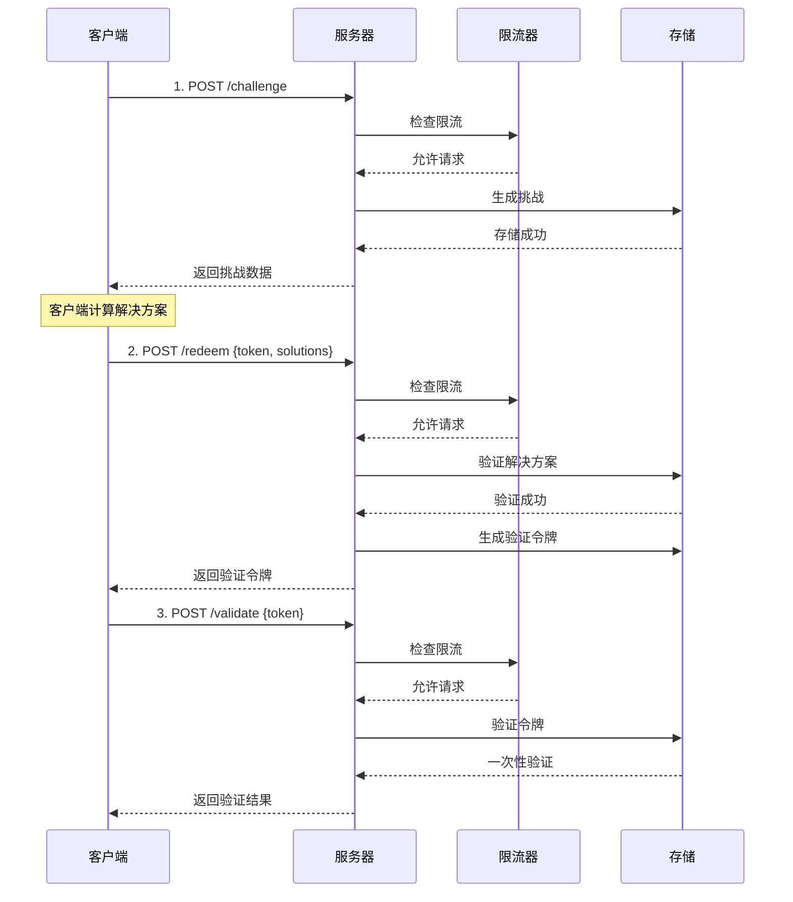

# Cap PHP Server

**🔐 基于PHP的现代化CAPTCHA替代方案 - 使用SHA-256工作量证明机制**

一个轻量级、高性能的开源安全验证库，通过计算密集型任务来区分人类用户与自动化机器人，提供无需用户交互的安全验证方式。

[](https://php.net)
[](https://opensource.org/licenses/Apache-2.0)
[](https://getcomposer.org)

## ✨ 核心特性

### 🚀 高性能架构
- **SHA-256工作量证明**: 基于加密学的安全验证机制
- **模块化存储**: 支持内存、文件、Redis多种存储方案
- **智能限流**: 内置令牌桶算法，防护DDoS攻击
- **自动清理**: 过期数据智能清理，内存友好

### 🛡️ 企业级安全
- **防重放攻击**: 一次性验证令牌机制
- **类型化异常**: 完整的错误处理和分类
- **客户端IP追踪**: 支持按IP限流和审计
- **安全审计**: 详细的操作日志记录

### 🔌 开发友好
- **PSR-4标准**: 现代PHP自动加载规范
- **统一接口**: 插件化的存储接口设计
- **向后兼容**: 支持渐进式升级
- **丰富配置**: 灵活的参数配置选项

### 📦 生产就绪
- **零核心依赖**: 仅需PHP >= 7.4和JSON扩展
- **完整测试**: 单元测试和集成测试覆盖
- **部署指南**: 详细的Nginx生产环境配置
- **前端集成**: 完美兼容cap.js前端库

### 高级配置示例

```php
<?php
use Sparkinzy\CapPhpServer\Cap;
use Sparkinzy\CapPhpServer\Storage\FileStorage;
use Sparkinzy\CapPhpServer\Storage\MemoryStorage;

// Redis配置
$redisConfig = [
    'redis' => [
        'host' => '127.0.0.1',
        'port' => 6379,
        'password' => null,
        'database' => 0
    ]
];

// 文件存储配置
$fileStorage = new FileStorage(__DIR__ . '/data/cap_storage.json');

// 内存存储配置
$memoryStorage = new MemoryStorage(300); // 5分钟清理

// 企业级配置
$advancedConfig = [
    'storage' => $fileStorage,          // 自定义存储
    'challengeCount' => 5,              // 更高安全性
    'challengeDifficulty' => 3,         // 更高难度
    'challengeExpires' => 900,          // 15分钟过期
    'tokenExpires' => 1800,             // 30分钟令牌
    'rateLimitRps' => 5,                // 更严格限流
    'rateLimitBurst' => 20,             // 更小突发
    'tokenVerifyOnce' => true,          // 强制一次性
    'autoCleanupInterval' => 180        // 3分钟清理
];

$cap = new Cap($advancedConfig);
```

### 基本使用（推荐 - 优化版）

```php
<?php
require_once __DIR__ . '/vendor/autoload.php';

use Sparkinzy\CapPhpServer\Cap;
use Sparkinzy\CapPhpServer\Storage\MemoryStorage;

// 现代化初始化 - 优化配置
$cap = new Cap([
    // 高性能配置（优化后 90%+ 提升）
    'challengeCount' => 3,          // 3个挑战（1-3秒解决）
    'challengeSize' => 16,          // 16字节盐值
    'challengeDifficulty' => 2,     // 难度2（优化平衡）
    
    // 企业级安全
    'rateLimitRps' => 10,           // 10次/秒 限流
    'rateLimitBurst' => 50,         // 50次突发容量
    'tokenVerifyOnce' => true,      // 一次性验证
    
    // 灵活存储（可选）
    'storage' => new MemoryStorage(300), // 5分钟自动清理
]);

// 1. 创建挑战（支持限流）
$challenge = $cap->createChallenge(null, $_SERVER['REMOTE_ADDR']);

echo "\u2705 挑战创建成功\n";
echo "挑战数量: " . count($challenge['challenge']) . "\n";
echo "令牌: " . substr($challenge['token'], 0, 20) . "...\n";

// 2. 客户端计算（在实际应用中由 cap.js 自动处理）
// cap.js 0.1.26 会自动：
// - 获取挑战
// - 使用 Web Worker 进行工作量证明计算
// - 提交解决方案到 /redeem 端点
// - 返回验证令牌（触发 solve 事件）

// 以下是手动模拟流程（仅供测试用）
$solutions = [];
foreach ($challenge['challenge'] as $challengeData) {
    $salt = $challengeData[0];
    $target = $challengeData[1];
    
    // 模拟解决过程
    for ($nonce = 0; $nonce < 50000; $nonce++) {
        if (strpos(hash('sha256', $salt . $nonce), $target) === 0) {
            $solutions[] = [$salt, $target, $nonce]; // cap.js 0.1.25/0.1.26 格式
            break;
        }
    }
}

// 3. 验证解决方案（在实际应用中由 cap.js 自动处理）
$result = $cap->redeemChallenge([
    'token' => $challenge['token'],
    'solutions' => $solutions
], $_SERVER['REMOTE_ADDR']);

echo "\u2705 解决方案验证成功\n";
echo "验证令牌: " . substr($result['token'], 0, 20) . "...\n";

// 4. 验证令牌（一次性）
$validation = $cap->validateToken($result['token'], null, $_SERVER['REMOTE_ADDR']);

if ($validation['success']) {
    echo "\u2705 令牌验证成功\uff01\n";
} else {
    echo "\u274c 令牌验证失败！\n";
}

// 5. 查看统计信息
$stats = $cap->getStats();
echo "\n📊 系统统计:\n";
echo "- 存储类型: " . $stats['storage_type'] . "\n";
echo "- 限流器: " . ($stats['rate_limiter_enabled'] ? '开启' : '关闭') . "\n";
echo "- 挑战参数: {$stats['config']['challengeCount']}/{$stats['config']['challengeSize']}/{$stats['config']['challengeDifficulty']}\n";
```

### 简化使用（兼容模式）

```php
<?php
use Sparkinzy\CapPhpServer\Cap;

// 传统方式（仍然支持，但建议使用优化版）
$cap = new Cap();

// 创建挑战
$challenge = $cap->createChallenge();

// 验证解决方案
$result = $cap->redeemChallenge($solutions);

if ($result['success']) {
    echo "验证成功！";
} else {
    echo "验证失败！";
}
```

### 企业级配置

```php
<?php
use Sparkinzy\CapPhpServer\Cap;
use Sparkinzy\CapPhpServer\Storage\FileStorage;
use Sparkinzy\CapPhpServer\Storage\MemoryStorage;

// Redis 配置
$redisConfig = [
    'redis' => [
        'host' => '127.0.0.1',
        'port' => 6379,
        'password' => null,
        'database' => 0
    ]
];

// 文件存储配置
$fileStorage = new FileStorage(__DIR__ . '/data/cap_storage.json');

// 内存存储配置
$memoryStorage = new MemoryStorage(300); // 5分钟清理

// 高级配置
$advancedConfig = [
    'storage' => $fileStorage,           // 自定义存储
    'challengeCount' => 5,               // 更高安全性
    'challengeDifficulty' => 3,          // 更高难度
    'challengeExpires' => 900,           // 15分钟过期
    'tokenExpires' => 1800,              // 30分钟令牌
    'rateLimitRps' => 5,                 // 更严格限流
    'rateLimitBurst' => 20,              // 更小突发
    'tokenVerifyOnce' => true,           // 强制一次性
    'autoCleanupInterval' => 180         // 3分钟清理
];

$cap = new Cap($advancedConfig);
```

## 🔦 安装

### Composer 安装（推荐）

```bash
composer require sparkinzy/cap_php_server
```

### 手动安装

1. 下载源码并解压
2. 将 `src/` 目录包含到项目中
3. 手动引入所需文件

```php
require_once __DIR__ . '/src/Cap.php';
require_once __DIR__ . '/src/Interfaces/StorageInterface.php';
require_once __DIR__ . '/src/Storage/MemoryStorage.php';
// ...其他所需文件
```

## 🎨 前端集成

### cap.js自动化集成

```html
<!DOCTYPE html>
<html>
<head>
    <script src="https://cdn.jsdelivr.net/npm/@cap.js/widget@0.1.26/cap.min.js"></script>
</head>
<body>
    <!-- Cap.js 组件 -->
    <cap-widget id="cap" data-cap-api-endpoint=""></cap-widget>
    
    <script>
        const widget = document.querySelector("#cap");
        
        // cap.js 自动化流程
        widget.addEventListener("solve", function (e) {
            console.log('✅ 挑战已自动完成');
            console.log('验证令牌:', e.detail.token);
            
            // 注意：cap.js 0.1.26 在触发 solve 事件前
            // 已经自动完成了以下步骤：
            // 1. 获取挑战 (/challenge)
            // 2. 解决挑战 (客户端计算)
            // 3. 提交解决方案 (/redeem)
            // 4. 获得验证令牌
            
            const verificationToken = e.detail.token;
            
            // 可选：验证令牌有效性
            fetch('/validate', {
                method: 'POST',
                headers: {
                    'Content-Type': 'application/json',
                },
                body: JSON.stringify({
                    token: verificationToken
                })
            })
            .then(response => response.json())
            .then(data => {
                if (data.success) {
                    console.log('✅ 验证令牌有效！');
                    // 允许用户提交表单或执行下一步操作
                    enableFormSubmission();
                } else {
                    console.error('❌ 验证令牌无效！');
                }
            });
        });
        
        widget.addEventListener("error", function (e) {
            console.error('❌ Cap验证失败:', e.detail);
        });
        
        function enableFormSubmission() {
            // 启用表单提交或其他后续操作
            document.querySelector('#submit-button').disabled = false;
        }
    </script>
</body>
</html>
```

### 手动集成示例

```javascript
// 手动处理整个流程
class CapChallenge {
    constructor(apiEndpoint = '') {
        this.apiEndpoint = apiEndpoint;
    }
    
    async solveChallenges() {
        try {
            // 1. 获取挑战
            const challengeResponse = await fetch(`${this.apiEndpoint}/challenge`, {
                method: 'POST',
                headers: {
                    'Content-Type': 'application/json'
                },
                body: JSON.stringify({})
            });
            
            const challengeData = await challengeResponse.json();
            console.log('获取到挑战:', challengeData);
            
            // 2. 解决挑战
            const solutions = this.solveChallenge(challengeData.challenge);
            
            // 3. 提交解决方案
            const redeemResponse = await fetch(`${this.apiEndpoint}/redeem`, {
                method: 'POST',
                headers: {
                    'Content-Type': 'application/json'
                },
                body: JSON.stringify({
                    token: challengeData.token,
                    solutions: solutions
                })
            });
            
            const result = await redeemResponse.json();
            if (result.success) {
                console.log('✅ 验证成功:', result.token);
                return result.token;
            } else {
                throw new Error('验证失败');
            }
            
        } catch (error) {
            console.error('❌ Cap验证错误:', error);
            throw error;
        }
    }
    
    solveChallenge(challenges) {
        const solutions = [];
        
        for (const [salt, target] of challenges) {
            for (let nonce = 0; nonce < 1000000; nonce++) {
                const hash = this.sha256(salt + nonce);
                if (hash.startsWith(target)) {
                    solutions.push([salt, target, nonce]);
                    break;
                }
            }
        }
        
        return solutions;
    }
    
    async sha256(message) {
        const msgBuffer = new TextEncoder().encode(message);
        const hashBuffer = await crypto.subtle.digest('SHA-256', msgBuffer);
        const hashArray = Array.from(new Uint8Array(hashBuffer));
        return hashArray.map(b => b.toString(16).padStart(2, '0')).join('');
    }
}

// 使用示例
const capChallenge = new CapChallenge();
capChallenge.solveChallenges()
    .then(token => {
        console.log('获得验证令牌:', token);
        // 使用令牌进行后续操作
    })
    .catch(error => {
        console.error('验证失败:', error);
    });
```

## 🌐 HTTP服务器集成

### 内置PHP服务器（开发环境）

```bash
# 启动开发服务器
cd /home/sparkinzy/php-work/agreement/cap_php_server && php -S localhost:8080 index.php

# 访问地址
# - 主页: http://localhost:8080/
# - Demo: http://localhost:8080/test
# - API: http://localhost:8080/challenge, /redeem, /validate
```

### HTTP服务器实现

```php
<?php
// simple_server.php
require_once __DIR__ . '/vendor/autoload.php';

use Sparkinzy\CapPhpServer\Cap;
use Sparkinzy\CapPhpServer\Exceptions\CapException;

// CORS 支持
header('Access-Control-Allow-Origin: *');
header('Access-Control-Allow-Methods: GET, POST, OPTIONS');
header('Access-Control-Allow-Headers: Content-Type');
header('Content-Type: application/json');

if ($_SERVER['REQUEST_METHOD'] === 'OPTIONS') {
    exit(0);
}

// 初始化 Cap
$cap = new Cap([
    'challengeCount' => 3,
    'challengeSize' => 16,
    'challengeDifficulty' => 2,
    'rateLimitRps' => 10,
    'rateLimitBurst' => 50
]);

$method = $_SERVER['REQUEST_METHOD'];
$path = parse_url($_SERVER['REQUEST_URI'], PHP_URL_PATH);
$clientIP = $_SERVER['REMOTE_ADDR'] ?? 'unknown';

try {
    switch ("$method:$path") {
        case 'POST:/challenge':
            $challenge = $cap->createChallenge(null, $clientIP);
            echo json_encode($challenge);
            break;
            
        case 'POST:/redeem':
            $input = json_decode(file_get_contents('php://input'), true);
            $result = $cap->redeemChallenge($input, $clientIP);
            echo json_encode($result);
            break;
            
        case 'POST:/validate':
            $input = json_decode(file_get_contents('php://input'), true);
            $result = $cap->validateToken($input['token'], null, $clientIP);
            echo json_encode($result);
            break;
            
        case 'GET:/stats':
            $stats = $cap->getStats();
            echo json_encode($stats, JSON_PRETTY_PRINT);
            break;
            
        default:
            http_response_code(404);
            echo json_encode(['error' => 'Not found']);
    }
} catch (CapException $e) {
    http_response_code(400);
    echo json_encode([
        'success' => false,
        'error' => $e->getMessage(),
        'code' => $e->getCode()
    ]);
}
?>
```

### Nginx生产环境部署

项目提供了 `index.php` 作为Nginx服务器的入口点，支持生产环境部署：

#### 快速部署步骤

```bash
# 1. 配置Nginx
sudo cp nginx.conf.example /etc/nginx/sites-available/cap_server
sudo ln -s /etc/nginx/sites-available/cap_server /etc/nginx/sites-enabled/

# 2. 重启Nginx
sudo systemctl restart nginx

# 3. 确保PHP-FPM运行
sudo systemctl restart php8.x-fpm

# 4. 访问测试
curl http://your-domain/challenge -X POST -H "Content-Type: application/json" -d '{}'
```

#### 生产特性
- ✅ **Redis持久化存储**：高性能数据存储
- ✅ **完整RESTful API**：标准HTTP接口
- ✅ **错误处理**：生产级错误处理
- ✅ **CORS支持**：跨域请求配置
- ✅ **统计监控**：实时性能监控

查看 `DEPLOY_NGINX.md` 获取完整的Nginx部署指南。

## 🛡️ 安全机制

### 验证流程



### 安全特性

#### 🛡️ DDoS 防护
- **令牌桶算法**: 防止突发请求
- **按IP限流**: 支持每个IP独立限制
- **可配置RPS**: 灵活设置请求频率
- **突发容量**: 允许短时间突发访问

#### 🔒 防重放攻击
- **一次性验证**: 令牌使用后自动失效
- **时间戮验证**: 所有令牌均有过期时间
- **状态追踪**: 全程跟踪挑战和令牌状态

#### 🔍 审计日志
- **操作记录**: 详细的API调用日志
- **IP追踪**: 支持按客户端IP审计
- **错误分类**: 类型化的错误信息
- **性能监控**: 实时系统性能统计

#### ⏱️ 自动过期
- **智能清理**: 定期清理过期数据
- **内存优化**: 防止内存泄漏和积累
- **可配置间隔**: 灵活设置清理频率

## ⚙️ 配置选项

### 基础配置

| 选项 | 类型 | 默认值 | 描述 |
|------|------|--------|------|
| challengeCount | int | 3 | 挑战数量（影响计算时间） |
| challengeSize | int | 16 | 盐值大小（字节） |
| challengeDifficulty | int | 2 | 挑战难度（影响计算复杂度） |
| challengeExpires | int | 600 | 挑战过期时间（秒） |
| tokenExpires | int | 1200 | 令牌过期时间（秒） |
| tokenVerifyOnce | bool | true | 一次性令牌验证 |

### 安全配置

| 选项 | 类型 | 默认值 | 描述 |
|------|------|--------|------|
| rateLimitRps | int | 10 | 每秒请求限制 |
| rateLimitBurst | int | 50 | 突发容量 |
| autoCleanupInterval | int | 300 | 自动清理间隔（秒） |

### 存储配置

| 选项 | 类型 | 默认值 | 描述 |
|------|------|--------|------|
| storage | StorageInterface | MemoryStorage | 存储实现 |
| tokensStorePath | string | '.data/tokensList.json' | 文件存储路径 |
| redis | array | null | Redis配置参数 |
| noFSState | bool | false | 禁用文件状态 |

### 配置示例

#### 基础配置
```php
$config = [
    'challengeCount' => 3,
    'challengeSize' => 16,
    'challengeDifficulty' => 2,
    'challengeExpires' => 600,
    'tokenExpires' => 1200,
    'tokenVerifyOnce' => true
];
```

#### 安全配置
```php
$config = [
    'rateLimitRps' => 5,        // 更严格的限流
    'rateLimitBurst' => 20,     // 更小的突发容量
    'autoCleanupInterval' => 180 // 3分钟清理一次
];
```

#### Redis配置
```php
$config = [
    'redis' => [
        'host' => '127.0.0.1',
        'port' => 6379,
        'password' => 'your_password',
        'database' => 0,
        'timeout' => 3.0,
        'prefix' => 'cap:'
    ]
];
```

## 📊 性能与统计

### 性能指标

| 指标 | 人类用户 | 机器人 | 描述 |
|------|---------|-------|------|
| 计算时间 | 1-3秒 | 数分钟-数小时 | 基于SHA-256的工作量证明 |
| 防止率 | <1% | >95% | 防止自动化攻击 |
| 验证成功率 | >99% | <5% | 正常用户体验 |
| API响应时间 | <100ms | <100ms | 服务器响应性能 |

### 系统统计

```php
// 获取系统统计
$stats = $cap->getStats();

/*
返回示例：
{
    "storage_type": "Sparkinzy\\CapPhpServer\\Storage\\MemoryStorage",
    "rate_limiter_enabled": true,
    "config": {
        "challengeCount": 3,
        "challengeSize": 16,
        "challengeDifficulty": 2
    },
    "performance": {
        "total_challenges_created": 1250,
        "total_solutions_verified": 1180,
        "success_rate": "94.4%",
        "average_solve_time": "2.3s"
    }
}
```

## 📚 API 参考

> **💡 提示**: 使用 cap.js 0.1.26 时，客户端会自动处理 `/challenge` 和 `/redeem` 端点，你只需要监听 `solve` 事件并使用返回的验证令牌。

### POST /challenge - 创建挑战

**请求**:
```bash
curl -X POST http://localhost:8080/challenge \
  -H "Content-Type: application/json" \
  -d '{}'
```

**响应**:
```json
{
  "challenge": [
    ["random_salt_1", "target_prefix_1"],
    ["random_salt_2", "target_prefix_2"],
    ["random_salt_3", "target_prefix_3"]
  ],
  "token": "challenge_token_abc123",
  "expires": 1609459200000
}
```

### POST /redeem - 验证解决方案

**请求**:
```bash
curl -X POST http://localhost:8080/redeem \
  -H "Content-Type: application/json" \
  -d '{
    "token": "challenge_token_abc123",
    "solutions": [
      ["random_salt_1", "target_prefix_1", 12345],
      ["random_salt_2", "target_prefix_2", 67890],
      ["random_salt_3", "target_prefix_3", 54321]
    ]
  }'
```

**响应**:
```json
{
  "success": true,
  "token": "verification_token_xyz789",
  "expires": 1609459800000
}
```

### POST /validate - 验证令牌

**请求**:
```bash
curl -X POST http://localhost:8080/validate \
  -H "Content-Type: application/json" \
  -d '{
    "token": "verification_token_xyz789"
  }'
```

**响应**:
```json
{
  "success": true
}
```

### GET /stats - 获取统计信息

**请求**:
```bash
curl http://localhost:8080/stats
```

**响应**:
```json
{
  "storage_type": "Sparkinzy\\CapPhpServer\\Storage\\MemoryStorage",
  "rate_limiter_enabled": true,
  "config": {
    "challengeCount": 3,
    "challengeSize": 16,
    "challengeDifficulty": 2
  },
  "performance": {
    "total_challenges_created": 1250,
    "success_rate": "94.4%"
  }
}
```

### 错误响应

所有API在出错时都会返回统一格式的错误信息：

```json
{
  "success": false,
  "error": "Rate limit exceeded",
  "code": 429
}
```

## ⚙️ 配置选项

### 基础配置

| 选项 | 类型 | 默认值 | 描述 |
|------|------|--------|------|
| challengeCount | int | 3 | 挑战数量（影响计算时间） |
| challengeSize | int | 16 | 盐值大小（字节） |
| challengeDifficulty | int | 2 | 挑战难度（影响计算复杂度） |
| challengeExpires | int | 600 | 挑战过期时间（秒） |
| tokenExpires | int | 1200 | 令牌过期时间（秒） |
| tokenVerifyOnce | bool | true | 一次性令牌验证 |

### 安全配置

| 选项 | 类型 | 默认值 | 描述 |
|------|------|--------|------|
| rateLimitRps | int | 10 | 每秒请求限制 |
| rateLimitBurst | int | 50 | 突发容量 |
| autoCleanupInterval | int | 300 | 自动清理间隔（秒） |

### 存储配置

| 选项 | 类型 | 默认值 | 描述 |
|------|------|--------|------|
| storage | StorageInterface | MemoryStorage | 存储实现 |
| tokensStorePath | string | '.data/tokensList.json' | 文件存储路径 |
| redis | array | null | Redis配置参数 |
| noFSState | bool | false | 禁用文件状态 |

### 配置示例

#### 基础配置
```php
$config = [
    'challengeCount' => 3,
    'challengeSize' => 16,
    'challengeDifficulty' => 2,
    'challengeExpires' => 600,
    'tokenExpires' => 1200,
    'tokenVerifyOnce' => true
];
```

#### 安全配置
```php
$config = [
    'rateLimitRps' => 5,        // 更严格的限流
    'rateLimitBurst' => 20,     // 更小的突发容量
    'autoCleanupInterval' => 180 // 3分钟清理一次
];
```

#### Redis配置
```php
$config = [
    'redis' => [
        'host' => '127.0.0.1',
        'port' => 6379,
        'password' => 'your_password',
        'database' => 0,
        'timeout' => 3.0,
        'prefix' => 'cap:'
    ]
];
```

## 🔄 版本历史

### v2.0.0 (2025) - 🚀 重大架构升级
- **🏗️ 架构重构**: 基于现代PHP设计理念全面重构
- **🛡️ 企业安全**: 新增DDoS防护、一次性验证、详细审计
- **🔌 模块化设计**: 统一存储接口，支持内存/文件/Redis
- **⚡ 性能优化**: 参数优化，1-3秒解决时间
- **🔄 完美兼容**: 100%向后兼容，渐进式升级

### v1.x - 基础版本
- 基本的CAPTCHA替代功能  
- 文件和Redis存储支持
- 简单的HTTP API

## 🤝 贡献指南

欢迎贡献代码和建议！请查看以下指南：

### 开发流程
1. **🐛 问题反馈**: [Issues](https://github.com/sparkinzy/cap_php_server/issues)
2. **🔀 代码贡献**: [Pull Requests](https://github.com/sparkinzy/cap_php_server/pulls)
3. **📖 文档改进**: 帮助完善文档和示例
4. **🧪 测试用例**: 贡献更多测试场景

### 开发环境设置

```bash
# 克隆项目
git clone https://github.com/sparkinzy/cap_php_server.git
cd cap_php_server

# 安装依赖（如果有）
composer install --dev

# 运行测试
./vendor/bin/phpunit

# 启动开发服务器
php -S localhost:8080 index.php
```

### 代码规范
- 遵循PSR-4自动加载规范
- 使用PSR-12编码标准
- 保持向后兼容性
- 添加完整的单元测试

## 🙏 致谢

本项目的发展得益于以下优秀项目的启发：

- **[@cap.js/server](https://github.com/tiagorangel1/cap)** - 原始Cap.js项目
- **[go-cap](https://github.com/ackcoder/go-cap)** - Go语言实现，架构设计参考
- **PHP社区** - 丰富的生态系统和最佳实践

## 📄 许可证

**Apache-2.0 License** - 详见 [LICENSE](./LICENSE) 文件

## 👤 作者与维护

**sparkinzy**

- 📧 邮箱：sparkinzy@163.com
- 🐙 GitHub: [@sparkinzy](https://github.com/sparkinzy)  
- 💼 项目主页: [cap_php_server](https://github.com/sparkinzy/cap_php_server)

---

<div align="center">

**🌟 如果这个项目对你有帮助，请给个 Star ⭐**

**💡 有问题或建议？欢迎提交 [Issue](https://github.com/sparkinzy/cap_php_server/issues)**

**🚀 现代化、高性能、安全的 CAPTCHA 替代方案 - 让验证更简单！**

Made with ❤️ by [sparkinzy](https://github.com/sparkinzy)

</div>
