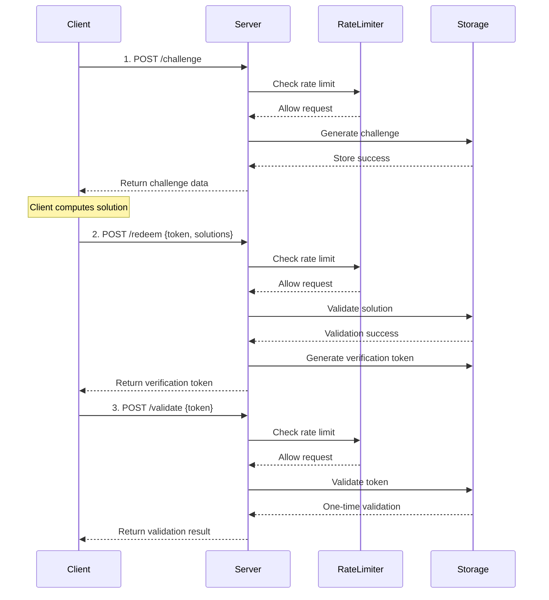

# Capito Cap PHP Server for cap.js captcha
<h2 align="center">
  
  <br>
  CAPITO
  <br>
<i>cap.js captcha php server</i>
</h2>


A lightweight, high-performance open-source security validation library that distinguishes human users from bots via compute-intensive tasks, providing a secure, interaction-free validation method. 

Compatible with 🧢[CapJs](https://capjs.js.org/) Widget [github](https://github.com/tiagozip/cap). 

Mainly crafted from [Sparkinzy Cap Php Server](https://github.com/Sparkinzy/cap_php_server) but also inspired by [Cap pow](https://github.com/clysss/cap-pow-php-server). 

[](https://php.net)
[](https://opensource.org/licenses/Apache-2.0)

## ✨ Core Features

### Architecture
- **SHA-256 Proof-of-Work**: Cryptographically secure validation mechanism
- **Modular Storage**: Supports memory, file, and Redis storage backends
- **Smart Rate Limiting**: Built-in token bucket algorithm for DDoS protection
- **Auto Cleanup**: Intelligent expiry and memory-friendly data cleaning

### Production 
- **Can be deployed without composer**: for low cost php servers - just copy files and play !
- **Large possibility of storage**: data can be store on a file, or on MySql, sqLite or Redis (and 5 minutes job to adapt to other DB)
- **Zero Core Dependencies**: Requires only PHP >= 7.4 and JSON extension
- **Full Testing**: Unit and integration test coverage
- **Deployment Guide**: Detailed Nginx production configuration
- **Frontend Integration**: Perfectly compatible with cap.js frontend library

### Security
- **Replay Attack Prevention**: One-time validation tokens
- **Typed Exceptions**: Comprehensive error handling and categorization
- **Rate limiting**: Per-IP rate limiting, compatible with proxy

### Developer 
- **PSR-4 Standard**: Modern PHP autoloading compliance
- **Unified Interfaces**: Pluggable storage interface design
- **international English**: sorry, even I should, I don't speak chinese yet


### Why we create a new repo/server and not just update Sparkinzy one ?
As of sept 2025, we needed a full functional PHP Server. Sparkinzy Cap is mostly in Chinese, but this was not the issue : Sparkinzy is supposed to offer 3 storage classes (redis, file, memory), but only redis seems to works correctly (the default memoryStorage can't run in PHP as PHP is stateless, and the fileStorage is buggy). Sparkinzy is also assuring compatibility with go-cap, and several legacy systems.

We needed urgently a clean, modern, fast, easy to maintain server, adapted to last version of cap.js, able to store data easily on files or DB (derivating a new storage class is very easy, even for an AI). Call to storage classes and storage optimized to limit overhead. Main functions of main class Cap has also been reworked to be fully compatible with storage, remove all legacy stuff and clean some points (for example make RateLimiter compatible with proxy). 

And a robust functional server (`captcha.php`) is provided. You just need to modify the configuration of it (storage type, and challenge config if needed) before copying to your server. 
...all in english : the translated doc include all the most important things, in one concise file.

Using git History, as we imported Sparkinzy to create this repo (initial branch), you'll be able to see exactly what has been done: In case of questions, don't hesitate to delve also into Sparkinzy. You'll find for example nginx informations. Again, thanks a lot to him for his project and his time 🥰.

## 📦 Configuration 
Configuration is typicaly set in captcha.php
### FileStorage configuration

```php
<?php
require_once __DIR__ . '/src/Cap.php';
require_once __DIR__ . '/src/Interfaces/StorageInterface.php';
require_once __DIR__ . '/src/Storage/FileStorage.php';
require_once __DIR__ . '/src/RateLimiter.php';
require_once __DIR__ . '/src/Exceptions/CapException.php';

use Capito\CapPhpServer\Cap;
use Capito\CapPhpServer\Storage\FileStorage;
use Capito\CapPhpServer\Exceptions\CapException;

$capServer = new Cap([
    // High-performance configuration (optimized for 90%+ improvement)
    'challengeCount' => 3,          // 3 challenges (1–3 seconds to solve)   [== 5 higher sec]
    'challengeSize' => 16,          // 16-byte salt    
    'challengeDifficulty' => 2,     // Difficulty 2 (balanced optimization)  [==3 hard]
    'rateLimitRps' => 10,           // 10 req/sec rate limit                 [==5 stricter rate]
    'rateLimitBurst' => 50,         // 50 burst capacity                     [==20 smaller burst]
    'tokenVerifyOnce' => true,      // One-time validation
    'challengeExpires' => 300,      // Expires in 5 minutes
    'tokenExpires' => 600,          // Token expires in 10 minutes  
    'storage' => new FileStorage(['path' => __DIR__ . '/../.data/cap_data.json'])
]);
$cap = new Cap($advancedConfig);
```

### sqLiteStorage configuration

```php
<?php
require_once __DIR__ . '/src/Cap.php';
require_once __DIR__ . '/src/Interfaces/StorageInterface.php';
require_once __DIR__ . '/src/Storage/SqliteStorage.php';
require_once __DIR__ . '/src/RateLimiter.php';
require_once __DIR__ . '/src/Exceptions/CapException.php';

use Capito\CapPhpServer\Cap;
use Capito\CapPhpServer\Storage\SqLiteStorage;
use Capito\CapPhpServer\Exceptions\CapException;

$capServer = new Cap([
    // High-performance configuration (optimized for 90%+ improvement)
    'challengeCount' => 3,          // 3 challenges (1–3 seconds to solve)   [== 5 higher sec]
    'challengeSize' => 16,          // 16-byte salt    
    'challengeDifficulty' => 2,     // Difficulty 2 (balanced optimization)  [==3 hard]
    'rateLimitRps' => 10,           // 10 req/sec rate limit                 [==5 stricter rate]
    'rateLimitBurst' => 50,         // 50 burst capacity                     [==20 smaller burst]
    'tokenVerifyOnce' => true,      // One-time validation
    'challengeExpires' => 300,      // Expires in 5 minutes
    'tokenExpires' => 600,          // Token expires in 10 minutes  
    'storage' => new SqliteStorage(['path' => __DIR__ . '/../.data/cap_data.sqlite'])
]);
$cap = new Cap($advancedConfig);
```

### MySql configuration

```php
require_once __DIR__ . '/src/Cap.php';
require_once __DIR__ . '/src/Interfaces/StorageInterface.php';
require_once __DIR__ . '/src/Storage/MysqlStorage.php';
require_once __DIR__ . '/src/RateLimiter.php';
require_once __DIR__ . '/src/Exceptions/CapException.php';

use Capito\CapPhpServer\Cap;
use Capito\CapPhpServer\Storage\MysqlStorage;
use Capito\CapPhpServer\Exceptions\CapException;

$capServer = new Cap([
    'challengeCount' => 3,          // 3 challenges (1–3 seconds to solve)   [== 5 higher sec]
    'challengeSize' => 16,          // 16-byte salt    
    'challengeDifficulty' => 2,     // Difficulty 2 (balanced optimization)  [==3 hard]
    'rateLimitRps' => 10,           // 10 req/sec rate limit                 [==5 stricter rate]
    'rateLimitBurst' => 50,         // 50 burst capacity                     [==20 smaller burst]
    'tokenVerifyOnce' => true,      // One-time validation
    'challengeExpires' => 300,      // Expires in 5 minutes
    'tokenExpires' => 600,          // Token expires in 10 minutes  
    'storage' => new MysqlStorage([
        'host'     => 'localhost',
        'dbname'   => 'your_database_name',
        'username' => 'your_username',
        'password' => 'your_password',
        // Optional: table name, defaults to 'cap_tokens'
        'table'    => 'cap_tokens'
    ])
]);
```

### More "challenging/secure" configuration
```
    'challengeCount' => 5,          // higher sec
    'challengeSize' => 16,          
    'challengeDifficulty' => 3,     // Difficulty 3 (hard)
    'rateLimitRps' => 5,           // only 5 req/sec rate limit, stricter rate
    'rateLimitBurst' => 20,         // 20 burst capacity, smaller burst
```

## 🔦 Installation
### Composer Installation

```bash
composer require Capito/cap_php_server
```

### Manual Installation

1. Download and extract the source code
2. Include the `src/` directory in your project
3. Manually require needed files

```php
require_once __DIR__ . '/src/Cap.php';
require_once __DIR__ . '/src/Interfaces/StorageInterface.php';
require_once __DIR__ . '/src/Storage/MemoryStorage.php';
// ...other required files
```

## 🎨 Frontend Integration

### cap.js Automated Integration

```html
<!DOCTYPE html>
<html>
<head>
    <script src="https://cdn.jsdelivr.net/npm/@cap.js/widget@0.1.26/cap.min.js"></script>
</head>
<body>
    <!-- Cap.js component -->
    <cap-widget id="cap" data-cap-api-endpoint=""></cap-widget>
    
    <script>
        const widget = document.querySelector("#cap");
        
        // cap.js automated workflow
        widget.addEventListener("solve", function (e) {
            console.log('✅ Challenge automatically completed');
            console.log('Verification token:', e.detail.token);
            
            // Note: Before firing the solve event, cap.js 0.1.26 has already:
            // 1. Fetched challenge (/challenge)
            // 2. Solved challenge (client computation)
            // 3. Submitted solution (/redeem)
            // 4. Received verification token
            
            const verificationToken = e.detail.token;
            
            // Optional: Validate token
            fetch('/validate', {
                method: 'POST',
                headers: {
                    'Content-Type': 'application/json',
                },
                body: JSON.stringify({
                    token: verificationToken
                })
            })
            .then(response => response.json())
            .then(data => {
                if (data.success) {
                    console.log('✅ Token is valid!');
                    // Allow form submission or next step
                    enableFormSubmission();
                } else {
                    console.error('❌ Invalid token!');
                }
            });
        });
        
        widget.addEventListener("error", function (e) {
            console.error('❌ Cap validation failed:', e.detail);
        });
        
        function enableFormSubmission() {
            // Enable form or further actions
            document.querySelector('#submit-button').disabled = false;
        }
    </script>
</body>
</html>
```


### 🛡️Validation Flow



### Security Features

#### 🛡️ DDoS Protection
- **Token Bucket Algorithm**: Prevents burst requests
- **Per-IP Rate Limiting**: Each IP has independent limits
- **Configurable RPS**: Flexible request frequency
- **Burst Capacity**: Allows short burst access

#### 🔒 Anti-Replay
- **One-time Validation**: Tokens expire after use
- **Timestamp Validation**: All tokens have expiry
- **State Tracking**: Full challenge and token status tracking

#### 🔍 Audit Logging
- **Operation Logs**: Detailed API call records
- **IP Tracking**: Per-client auditing
- **Error Categorization**: Typed error info
- **Performance Monitoring**: Real-time system stats

#### ⏱️ Auto Expiry
- **Smart Cleanup**: Periodic expiry cleanup
- **Memory Optimization**: Prevents leaks and accumulation
- **Configurable Interval**: Flexible cleanup schedule

## ⚙️ Configuration Options

### Basic Configuration

| Option                | Type            | Default | Description                            |
|-----------------------|-----------------|---------|----------------------------------------|
| challengeCount        | int             | 3       | Number of challenges (affects time)    |
| challengeSize         | int             | 16      | Salt size (bytes)                      |
| challengeDifficulty   | int             | 2       | Challenge difficulty (affects compute) |
| challengeExpires      | int             | 600     | Challenge expiry (seconds)             |
| tokenExpires          | int             | 1200    | Token expiry (seconds)                 |
| tokenVerifyOnce       | bool            | true    | One-time token validation              |

### Security Configuration

| Option                | Type            | Default | Description                            |
|-----------------------|-----------------|---------|----------------------------------------|
| rateLimitRps          | int             | 10      | Requests per second limit              |
| rateLimitBurst        | int             | 50      | Burst capacity                         |
| autoCleanupInterval   | int             | 300     | Cleanup interval (seconds)             |

### System Stats

```php
// Get system stats
$stats = $cap->getStats();

/*
Sample response:
{
    "storage_type": "Capito\\CapPhpServer\\Storage\\MemoryStorage",
    "rate_limiter_enabled": true,
    "config": {
        "challengeCount": 3,
        "challengeSize": 16,
        "challengeDifficulty": 2
    },
    "performance": {
        "total_challenges_created": 1250,
        "total_solutions_verified": 1180,
        "success_rate": "94.4%",
        "average_solve_time": "2.3s"
    }
}
*/
```

## 📚 API Reference

> **💡 Tip**: When using cap.js 0.1.26, the client automatically handles `/challenge` and `/redeem` endpoints. Just listen for the `solve` event and use the returned verification token.

### POST /challenge – Create Challenge

**Request**:
```bash
curl -X POST http://localhost:8080/challenge \
  -H "Content-Type: application/json" \
  -d '{}'
```

**Response**:
```json
{
  "challenge": [
    ["random_salt_1", "target_prefix_1"],
    ["random_salt_2", "target_prefix_2"],
    ["random_salt_3", "target_prefix_3"]
  ],
  "token": "challenge_token_abc123",
  "expires": 1609459200000
}
```

### POST /redeem – Validate Solution

**Request**:
```bash
curl -X POST http://localhost:8080/redeem \
  -H "Content-Type: application/json" \
  -d '{
    "token": "challenge_token_abc123",
    "solutions": [
      ["random_salt_1", "target_prefix_1", 12345],
      ["random_salt_2", "target_prefix_2", 67890],
      ["random_salt_3", "target_prefix_3", 54321]
    ]
  }'
```

**Response**:
```json
{
  "success": true,
  "token": "verification_token_xyz789",
  "expires": 1609459800000
}
```

### POST /validate – Validate Token

**Request**:
```bash
curl -X POST http://localhost:8080/validate \
  -H "Content-Type: application/json" \
  -d '{
    "token": "verification_token_xyz789"
  }'
```

**Response**:
```json
{
  "success": true
}
```

### GET /stats – Get Statistics

**Request**:
```bash
curl http://localhost:8080/stats
```

**Response**:
```json
{
  "storage_type": "Capito\\CapPhpServer\\Storage\\MemoryStorage",
  "rate_limiter_enabled": true,
  "config": {
    "challengeCount": 3,
    "challengeSize": 16,
    "challengeDifficulty": 2
  },
  "performance": {
    "total_challenges_created": 1250,
    "success_rate": "94.4%"
  }
}
```

### Error Responses

All APIs return a unified error format on failure:

```json
{
  "success": false,
  "error": "Rate limit exceeded",
  "code": 429
}
```

## 🙏 Acknowledgments

This project is inspired by the following excellent projects:
- **[@sparkinzy](https://github.com/sparkinzy)** - Thanks a lot for this great job  
- **[Cap pow](https://github.com/clysss/cap-pow-php-server)** - 
- **[@cap.js/server](https://github.com/tiagorangel1/cap)** – Original Cap.js project
- **[go-cap](https://github.com/ackcoder/go-cap)** – Go implementation, architecture reference
- **PHP Community** – Rich ecosystem and best practices

## 📄 License

**Apache-2.0 License** – see [LICENSE](https://www.apache.org/licenses/LICENSE-2.0) for details
